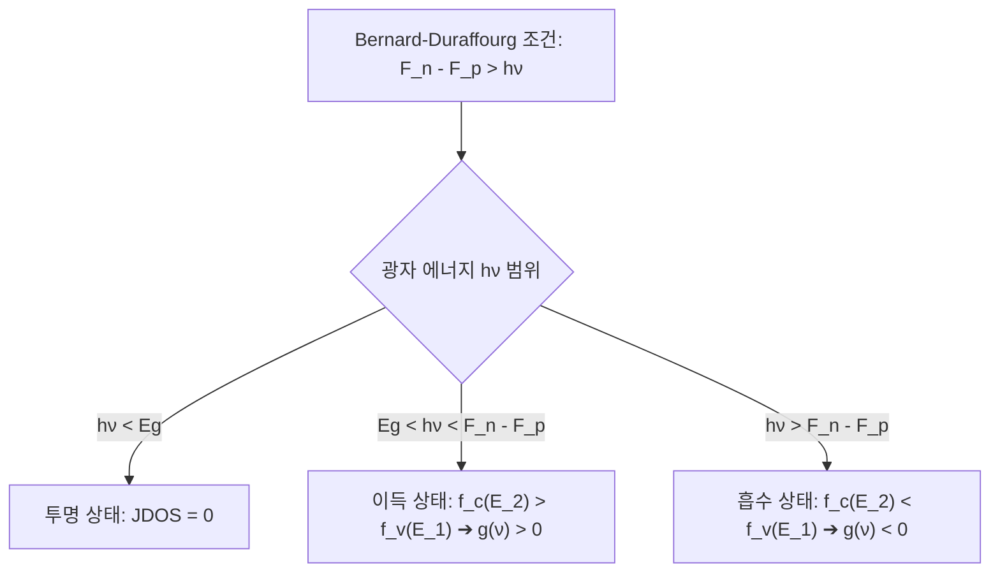

유튜브 강의 영상 자막의 한글 번역본입니다.

### 강의 동영상

<iframe width="100%" height="400" src="https://www.youtube.com/embed/Ctw5c3FC-5c" frameborder="0" allow="accelerometer; autoplay; clipboard-write; encrypted-media; gyroscope; picture-in-picture" allowfullscreen></iframe>

---

### 강의 해설 및 보충 설명 (Lecture Analysis)

본 강의는 반도체 레이저 다이오드(Semiconductor Laser Diode) 및 반도체 광증폭기(SOA: Semiconductor Optical Amplifier)에서 광학적 이득(Optical Gain)이 발생하는 물리적 메커니즘을 정량적으로 유도하고 설명합니다. 이를 위해 전도대(Conduction Band)와 가전자대(Valence Band)의 에너지 준위 분포를 나타내는 **광학적 결합 상태 밀도(Optical Joint Density of States)**와, 외부 전기적 에너지 주입에 의한 비평형 상태를 기술하는 **준-페르미 준위(Quasi-Fermi Levels)**를 결합하여 이득 및 흡수 속도 방정식을 도출합니다.

#### 1. 광학적 결합 상태 밀도 (Optical Joint Density of States, JDOS)

반도체에서 광자의 흡수 또는 방출은 가전자대의 상태 $E_1$과 전도대의 상태 $E_2$ 사이의 전이(Transition)를 통해 일어납니다. 광자의 에너지 $h\nu$가 두 상태의 에너지 차이와 일치해야 하므로, 전이에 참여하는 상태들의 쌍(pair)의 밀도를 정의할 필요가 있습니다. 이를 **광학적 결합 상태 밀도(Optical Joint Density of States, JDOS)**라고 하며, 3차원 벌크(Bulk) 반도체의 경우 다음과 같이 표현됩니다.

$$\rho_{\text{joint}}(h\nu) = \frac{1}{2\pi^2} \left(\frac{2m_r^*}{\hbar^2}\right)^{3/2} \sqrt{h\nu - E_g}$$

여기서 $m_r^*$은 전도대 전자 유효 질량 $m_e^*$와 가전자대 정공 유효 질량 $m_h^*$의 조화 평균인 **환산 유효 질량(Reduced Effective Mass)**입니다.

$$\frac{1}{m_r^*} = \frac{1}{m_e^*} + \frac{1}{m_h^*}$$

$E_g$는 반도체의 밴드갭(Band Gap) 에너지입니다. 에너지 $h\nu < E_g$인 영역에서는 상태가 존재하지 않으므로 $\rho_{\text{joint}} = 0$이 되어 반도체 매질은 빛에 대해 완전히 투명(Transparent)한 상태가 됩니다.

#### 2. 준-페르미 준위 (Quasi-Fermi Levels)와 점유 확률

반도체 소자에 배터리를 연결하여 순방향 바이어스를 인가하면, 외부로부터 과잉 캐리어(전자와 정공)가 활성 영역으로 주입됩니다. 이 상태는 열적 평형(Thermodynamic Equilibrium)이 깨진 **비평형 상태(Non-equilibrium State)**이므로, 전체 계를 단일 페르미 준위($E_F$)로 기술할 수 없습니다.

대신 전도대 내부의 전자들과 가전자대 내부의 정공들은 각각의 밴드 내에서 매우 빠르게(피코초 이하 스케일로) 열화(Thermalization)되어 각각의 국소적 평형 상태를 이룹니다. 이를 기술하기 위해 전도대 준-페르미 준위 $F_n$과 가전자대 준-페르미 준위 $F_p$를 도입하며, 각 상태의 전자 점유 확률은 페르미-디랙 분포 함수를 따릅니다.

$$f_c(E_2) = \frac{1}{1 + \exp\left(\frac{E_2 - F_n}{k_B T}\right)}$$

$$f_v(E_1) = \frac{1}{1 + \exp\left(\frac{E_1 - F_p}{k_B T}\right)}$$

두 준-페르미 준위의 분리 정도는 외부에서 인가된 전압 $V$에 직접 비례합니다.

$$F_n - F_p = qV$$

이 준-페르미 준위들의 분리는 반도체 소자가 LED, 광검출기, 태양전지, 혹은 레이저로 동작하게 만드는 핵심 변수입니다.

#### 3. 전이 속도 방정식 (Transition Rate Equations)

미소 에너지 구간 내에서 전도대와 가전자대 간 전이 과정은 세 가지 기본 물리적 경로를 따릅니다.

##### (1) 자발 방출 속도 (Spontaneous Emission Rate, $R_{\text{sp}}$)
자발 방출은 외부 광자 필드 없이 상위 상태 $E_2$에 전자가 존재하고($f_c(E_2)$), 하위 상태 $E_1$이 비어 있을($1 - f_v(E_1)$) 확률에 비례하여 발생합니다.
$$r_{\text{sp}}(\nu) = A \rho_{\text{joint}}(\nu) f_c(E_2) [1 - f_v(E_1)]$$
여기서 $A$는 아인슈타인 $A$ 계수입니다. 
열평형 상태 혹은 저주입 상태(Boltzmann 근사 적용 시, $E_2 - F_n \gg k_B T$ 및 $F_p - E_1 \gg k_B T$)에서는 다음과 같이 간단한 형태로 근사할 수 있습니다.
$$r_{\text{sp}}(\nu) \approx A \rho_{\text{joint}}(\nu) \exp\left(-\frac{h\nu - (F_n - F_p)}{k_B T}\right) = A \rho_{\text{joint}}(\nu) \exp\left(-\frac{h\nu - qV}{k_B T}\right)$$
인가 전압 $V = 0$인 평형 상태에서는 분자의 $h\nu \gg k_B T$이므로 자발 방출량이 무시할 수 있을 정도로 작지만, 순방향 전압을 인가하여 $qV \approx E_g$에 도달하면 자발 방출이 10의 20승 배 이상 폭발적으로 증가하여 LED가 밝은 빛을 내게 됩니다.

##### (2) 유도 방출 속도 (Stimulated Emission Rate, $R_{\text{st}}$) 및 흡수 속도 (Absorption Rate, $R_{\text{ab}}$)
유도 방출 och 흡수는 공통적으로 매질 내 광자 에너지 밀도 $\rho_\nu$에 비례합니다. 반도체에서는 미시적 가역성(Microscopic Reversibility)에 의해 유도 방출 계수와 흡수 계수가 동일하므로 ($B_{12} = B_{21} = B$), 다음과 같이 정의됩니다.
$$r_{\text{st}}(\nu) = B \rho_{\text{joint}}(\nu) \rho_\nu f_c(E_2) [1 - f_v(E_1)]$$
$$r_{\text{ab}}(\nu) = B \rho_{\text{joint}}(\nu) \rho_\nu f_v(E_1) [1 - f_c(E_2)]$$

##### (3) 순 방출 속도 (Net Emission Rate, $R_{\text{net}}$)
순 유도 방출 속도는 유도 방출 속도에서 흡수 속도를 뺀 값입니다.
$$r_{\text{net}}(\nu) = r_{\text{st}}(\nu) - r_{\text{ab}}(\nu) = B \rho_{\text{joint}}(\nu) \rho_\nu [f_c(E_2) - f_v(E_1)]$$
전개 과정에서 크로스 항($f_c f_v$)이 상쇄되어 페르미 함수의 단순한 차이만이 남는 것을 알 수 있습니다.

#### 4. 광학적 이득 계수 (Optical Gain Coefficient, $g(\nu)$)의 유도

빛이 반도체 매질을 통과하며 $z$ 방향으로 전파될 때, 세기 $I(\nu)$의 공간적 변화율은 다음과 같은 연속 방정식으로 기술됩니다.

$$\frac{dI(\nu)}{dz} = g(\nu) I(\nu)$$

세기 $I(\nu)$와 광자 밀도 $\rho_\nu$는 에너지 전파 속도(광속 $v = c/n$)를 통해 다음과 같은 관계를 갖습니다.

$$I(\nu) = \rho_\nu \frac{c}{n}$$

매질을 지나며 단위 부피당 초당 증가하는 에너지는 순 방출 속도에 광자 한 개의 에너지를 곱한 값($r_{\text{net}}(\nu) h\nu$)이므로, 다음과 같이 쓸 수 있습니다.

$$\frac{dI(\nu)}{dz} = r_{\text{net}}(\nu) h\nu = B \rho_{\text{joint}}(\nu) \left(I(\nu) \frac{n}{c}\right) [f_c(E_2) - f_v(E_1)] h\nu$$

아인슈타인 관계식 $\frac{A}{B} = \frac{8\pi h\nu^3 n^3}{c^3}$를 대입하여 $B$를 $A$로 변환하면 최종적인 소신호 이득 계수 $g(\nu)$를 얻게 됩니다.

$$g(\nu) = A \frac{c^2}{8\pi n^2 \nu^2} \rho_{\text{joint}}(\nu) [f_c(E_2) - f_v(E_1)]$$

이 식의 차원은 길이의 역수($\text{cm}^{-1}$)이며, 반도체 레이저 다이오드의 전형적인 최대 이득 값은 주입 조건에 따라 $2000 \sim 5000\text{ cm}^{-1}$에 달할 정도로 매우 높습니다.

#### 5. 이득 조건과 Bernard-Duraffourg 관계식

반도체 매질에서 흡수보다 유도 방출이 더 우세하여 이득을 얻기 위한 조건(즉, $g(\nu) > 0$)은 다음과 같습니다.

$$f_c(E_2) > f_v(E_1)$$

이 부등식을 페르미-디랙 분포 식에 대입하여 정리하면 다음과 같은 결론에 도달합니다.

$$E_2 - F_n < E_1 - F_p \implies F_n - F_p > E_2 - E_1 = h\nu$$

또한 물리적인 천이가 발생하려면 광자 에너지가 최소한 밴드갭 이상이어야 하므로 ($h\nu > E_g$), 최종적인 이득 달성 조건은 다음과 같이 주어집니다.

$$F_n - F_p > h\nu > E_g$$

이를 **Bernard-Duraffourg 조건**이라고 합니다.

이 조건은 이득이 발생하는 주파수 구간(윈도우)이 유한함을 보여줍니다.
- $h\nu < E_g$: 결합 상태 밀도가 존재하지 않아 투명함 ($g(\nu) = 0$).
- $E_g < h\nu < F_n - F_p$: 인구 역전 상태가 달성되어 순 유도 방출이 발생하고 광학적 이득을 얻음 ($g(\nu) > 0$).
- $h\nu > F_n - F_p$: 인구 역전이 일어나지 않아 흡수가 유도 방출을 압도하고 광학적 손실을 겪음 ($g(\nu) < 0$).

주입 전류가 증가할수록 $F_n$은 올라가고 $F_p$는 내려가 $F_n - F_p$가 커지므로, 이득을 얻을 수 있는 윈도우의 폭(대역폭)과 이득의 최대 피크 값이 함께 증가하게 됩니다.

---

### 강의 자막 직역본

<b>[00:00 - 15:00] 자막 번역 보기</b>

[00:01] 좋습니다, 시작합시다. 오늘은 반도체와 반도체 레이저에서의 이득(gain)에 대해 이야기하겠습니다. 지난 수업에서 저는 광학적 결합 상태 밀도(optical joint density of states)의 개념과 그 물리적 의미를 정립하는 데 꽤 많은 시간을 보냈습니다. 그 물리적 의미는 반도체 결정 내에 전자가 존재할 수 있는 수많은 상태를 가진 전도대(conduction band)가 있고, 가전자대(valence band)도 존재한다는 것입니다. 여기 그려진 것은 이 축을 기준으로 본 상태 밀도(density of states), 즉 미소 에너지 구간 내에 얼마나 많은 상태가 존재하는지를 나타냅니다. 밴드갭(gap) 내부에는 아무런 상태가 존재하지 않는데, 이곳은 반도체 내 전자가 가질 수 없는 금지된 에너지 영역입니다. 이 영역의 전자는 전파되지 않는 정지파(standing wave)를 형성하게 되는데, 이는 전자의 파장이

[01:02] 원자 사이의 거리와 맞아떨어지기 때문입니다. 따라서 이 에너지 영역 내에서 전자는 에너지를 가질 수 없으며, 이것이 바로 밴드갭(band gap)입니다. 하지만 이제 우리는 전자가 존재할 수 있는 허용된 상태에 더 관심이 있으며, 구체적으로는 "얼마나 많은 전자 상태가 에너지 $h\nu$를 가진 광자를 방출하거나 흡수할 수 있는가?"라는 질문에 관심이 있습니다. 이것이 바로 우리가 묻고자 하는 것이며, 그것이 광학적 결합 상태 밀도(optical joint density of states)입니다. 지난 수업에서 우리는 이 관계식을 유도하는 데 약간의 시간을 보냈습니다. 다양한 차원에서의 상태 밀도 유도를 보신 분들은 이것이 3차원 또는 벌크(bulk) 형태임을 알 수 있을 것입니다. 오늘 수업이 끝날 때쯤에는

[02:04] 양자화된 구조인 나노 구조에 대해 조금 더 이야기할 것입니다. 예를 들어 오늘날의 반도체 레이저나 광증폭기, 혹은 LED조차도 벌크(bulk) 물질을 사용하지 않고 양자 우물(quantum well)이나 양자점(quantum dot) 같은 것을 사용하는데, 그 이유에 대해 설명하겠습니다. 하지만 핵심은 우리가 3차원 물질의 광학적 결합 상태 밀도를 구하는 방법을 알면 2차원, 1차원, 혹은 0차원은 전혀 문제가 되지 않는다는 것입니다. 매우 명확하며 근본적으로 동일한 전략입니다. 그래서 이에 대해 논의하는 데 시간을 보냈습니다. 하지만 우리가 알다시피, 예를 들어 이 물질에서 광자가 방출되기 위해서는 전도대의 이 상태에는 전자가 채워져 있어야 하고, 가전자대의 이 상태는 비어 있어야 합니다. 그래야 전자가 채워진 상태에서 비어 있는 상태로 전이하면서 광자를 방출할 수 있기 때문입니다. 그렇기 때문에 우리는 전도대와 가전자대의 점유 함수(occupation function)인 두 함수에 대해 논의했던 것입니다.

[03:06] 그래서 먼저 우리는 주파수 $\nu$의 함수로서 광학적 결합 상태 밀도에 대해 이야기했고, 3차원의 경우 그 관계식을 이미 얻었습니다. 따라서 그것을 먼저 찾아야 합니다. 그다음 우리는 이 상태가 점유될 확률이 얼마인지 논의했는데, 이는 약간 수정된 페르미-디락(Fermi-Dirac) 분포로 주어집니다. 여기서 수정된 부분은 주로 준-페르미 준위(quasi-Fermi level)라는 물리량입니다. 이것은 유용한 전자 소자나 광전 소자에서 필수적인데, 소자를 배터리에 연결하고 캐리어를 주입하여 페르미 준위를 미세하게 조정할 것이기 때문입니다. 즉, 과잉 전자를 많이 주입하면 준-페르미 준위가 높아집니다. 오늘 몇 가지 시뮬레이션도 볼 것입니다. 마찬가지로 가전자대의 더 낮은 상태인 $E_1$에 대해서도 우리는 또 다른

[04:11] 정공(hole)을 위한 또 다른 준-페르미 준위가 존재하게 됩니다. 여러분의 교재에는 양전하를 의미하는 $P$와 음전하인 전자를 의미하는 $n$으로 라벨이 붙어 있습니다. 레이저 물리학에서는 다른 많은 소자들과 달리, 반도체 레이저를 다룰 때 정공에 대해 너무 많이 생각하기보다는 단순히 전자의 관점에서 생각하는 것이 좋습니다. 즉, 전도대에도 전자가 있고 가전자대에도 전자가 있는 것입니다. 물론 아래로의 전이를 가능하게 하는 가전자대의 상태는 비어 있는 상태이며, 우리도 그런 방식으로 접근할 것입니다. 하지만 두 밴드 모두, 즉 전도대 전자는 이 분포를 따르고 가전자대 전자는 저 분포를 따릅니다. 결과적으로 그들은 자신만의 페르미 준위와 페르미 함수를 갖게 됩니다.

[05:13] 전도대 내의 전자는 그들끼리 열적 평형 상태에 있고, 연결된 배터리의 단자와도 평형을 이룹니다. 가전자대의 전자 역시 그들끼리 평형을 이루며, 연결된 배터리 단자와 평형을 이룹니다. 이것이 의미하는 바는 다이오드의 n형 영역이 될 n형 반도체가 전도대의 준-페르미 준위($F_n$ 혹은 $F_c$)를 제어하고, p형 반도체 영역과 그 전극이 가전자대의 준-페르미 준위($F_p$ 혹은 $F_v$)를 제어한다는 것입니다. 따라서 이들은 외부 배터리에 의해 제어되며, $F_n$과 $F_p$ 사이의 전위차는 공급되는 전압에 전하량 $q$를 곱한 값인 $qV$가 됩니다. 1V든 2V든 인가하는 전압에 따라 달라집니다. 이처럼 두 준-페르미 준위를 분리시키는 것이 PN 다이오드 기반 광전 소자의 기본 개념이며, 지난 시간에 간단히 언급했습니다.

[06:14] PN 다이오드 기반의 광전 소자는 오늘 논의를 거치면서 가해주는 전압과 약간의 디자인 변형에 따라 실제로 여러 형태를 가질 수 있음을 보게 될 것입니다. 자발 방출(spontaneous emission)을 이용하는 발광 다이오드(LED)가 될 수도 있고, 광자를 검출하는 광검출기(photodetector)가 될 수도 있으며, 약간 변형하면 태양전지(solar cell)가 됩니다. 가장 대중적인 태양전지 역시 PN 다이오드입니다. 실리콘이나 갈륨 비소(GaAs) 기반인데, 우주용은 갈륨 비소 기반이고 지상용은 실리콘 기반입니다. 또한 레이저 직전 단계인 반도체 광증폭기(SOA)를 구성할 수도 있는데, 이는 이득이 있는 영역을 만들어 예를 들어 100개의

[07:15] 100개의 광자가 들어와서 동일한 에너지를 가진 200개의 광자가 나가는 장치입니다. 이것이 반도체 광증폭기(SOA)입니다. 그리고 물론 레이저도 있는데, 결국 모두 동일한 구조와 개념을 가지고 있습니다. 이 다양한 소자들에서 우리가 조절하는 것은 장치에 바이어스를 인가하고 작동시키는 방식에 따라 결정되는 두 가지 함수, 즉 페르미 함수입니다. 광검출기, SOA, 레이저는 광통신 시스템에 필요한 뼈대를 형성합니다. 레이저는 특정 바이어스 조건 하에 전류를 빛으로 변환하는 PN 다이오드이므로, 특정 바이어스를 인가하면 결이 맞는(coherent) 광자를 생성합니다. 그리고 이를 초당 수십 기가비트(Gbps)의 매우 빠른 속도로 켜고 끌 수 있습니다. 이렇게 생성된 빛을

[08:17] 광섬유에 실어 지구 반대편이나 대서양 너머로 보낸 뒤, 반대편에서 또 다른 PN 다이오드인 광검출기를 이용해 그 광자들을 감지해내는 것입니다. 하지만 빛이 진행하면서 감쇠(loss)가 발생하므로 이 매질 내에 이득(gain)이 필요합니다. 이를 위해 반도체 광증폭기(SOA)가 필요합니다. 광자가 감쇠할 때마다 신호를 재생하고 또 재생하는 것이죠. 이것이 모든 광통신 시스템의 기본 개념입니다. 이것은 지구적 규모뿐만 아니라 행성 간 통신, 혹은 태양계 밖으로 신호를 보낼 때도 적용될 수 있습니다. 진공에서는 다행히 빛이 거의 흡수되지 않아 SOA를 설치할 필요가 없겠지만요. 또한 이 모든 시스템을 칩 크기로 축소할 수도 있습니다. 광학 집적 회로(photonic integrated circuit)를 구축하여 레이저 광원과 정보 전송 장치, 즉 완전한 정보 시스템을 단일 칩 위에 구현할 수 있습니다. 이것이 바로

[09:18] 반도체 소자의 아름다운 점으로, 마이크론 스케일에서부터 아주 거대한 스케일까지 아우를 수 있습니다. 좋습니다. 이제 이득(gain)의 개념으로 넘어가 보겠습니다. 이득을 이해하기 위해, 입력 광자의 에너지가 반도체의 밴드갭보다 작다면 광자가 흡수되지 않고 그대로 통과하여 투명하다는 사실은 매우 명확합니다. 반도체가 투명한 것이죠. 예를 들어 밴드갭이 $3.4\text{ eV}$인 질화 갈륨(GaN) 같은 와이드 밴드갭 반도체는 유리처럼 보여 완전히 투명하게 들여다볼 수 있습니다. 반면 실리콘은 가시광선 파장을 흡수하기 때문에 어둡게 보이며 거울처럼 반사됩니다. 광자가 통과하려고 할 때 전이가 일어나기 때문입니다. 따라서

[10:18] 가변 광원이 있어서 광자의 에너지를 점차 높여간다고 할 때, 밴드갭 에너지를 넘어서기 전까지는 아무 일도 일어나지 않고 빛이 그냥 통과하지만, 갭에 도달하는 순간 많은 흡수가 관찰되기 시작하는 것은 매우 논리적인 결과입니다. 하지만 우리가 진짜 관심 있는 것은 반도체에 어떠한 조치를 취하는 것입니다. 기본적으로 우리는 인구 역전(population inversion) 상태를 만들고자 합니다. 매질을 펌핑(pumping)하여 전도대는 비어 있고 가전자대에만 전자가 차 있는 상태 대신, 이를 뒤집는 인구 역전을 이뤄내려는 것입니다. 이렇게 인구 역전이 일어나면, 아시다시피 이 에너지 윈도우에 부합하는 적절한 에너지를 가진 광자가 들어왔을 때 유도 방출(stimulated emission)을 자극하게 되며, 결과적으로 1개의 광자가 들어와서 2개의 광자가 나가게 됩니다. 이것이 이득(gain)이며, 상태의 밴드(band)를 다룬다는 점을 제외하면 원자 시스템에서의 이득과 완전히 동일합니다. 따라서 이 영역에 인구 역전을 형성하고 파동을 입력하면, 손실 대신 이득을 얻어 동일한 에너지의 광자가 더 많이 방출되게 됩니다.

[11:18] 하지만 이 이득이 매우 넓은 대역에 걸쳐 발생하는 것이 아니라, 우리가 형성한 인구 역전의 정도에 따라 결정되는 제한된 구간에서만 발생한다는 것을 곧 보게 될 것입니다. 그것이 바로 이득 스펙트럼(gain spectrum)이며, 이득 스펙트럼은 흡수/손실 스펙트럼(loss spectrum)을 그대로 뒤집어 놓은 마이너스 형태가 됩니다. 이를 정량적으로 다룰 것입니다만 이것이 기본 개념입니다. 크기 수준(order of magnitude)을 보면 최대 이득 값은 $4000\text{ cm}^{-1}$에서 $5000\text{ cm}^{-1}$에 달할 정도로 상당히 높습니다. 예를 들어 여기 그려진 그림은 반도체 광증폭기(SOA)의 예시입니다. 광섬유를 이 영역에 결합하여 신호를 주입하고 다시 광섬유로 출력하는 구조로, 광자가 통과할 때마다 이 영역에서 이득을 얻습니다.

[12:19] 광자들이 지나갈 때 그 영역에 이득이 존재하기 때문입니다. 하지만 레이저를 만들기 위해서는 양쪽에 거울을 배치하고 일정한 반사율을 확보하여 레이저 내부의 캐비티(cavity)를 채워야 합니다. 따라서 반도체 광증폭기(SOA)의 경우 양쪽 단면에 반사 방지(anti-reflection, AR) 코팅을 하여 빛이 반사되지 않고 그대로 통과하도록 만들어야 합니다. 반면 레이저의 경우에는 반사율이 높은 반사 코팅으로 거울을 만들어야 합니다. 이는 매우 합리적인데, 빛을 그냥 통과시키면서 이득만 얻으려면 반사 방지 코팅이 필요하고, 레이저 발진을 하려면 빛이 물질 내부에서 앞뒤로 계속 반사되도록 반사 코팅을 하고 캐비티를 형성해야 하기 때문입니다. 좋습니다. 이제 크기에 신경 쓰지 말고 이득의 개념을 살펴보겠습니다. 지난 시간에 제가

[13:21] 반도체 레이저의 소신호 이득 스펙트럼(small-signal gain spectrum)이 원자 시스템과 매우 유사하다고 썼던 것 같습니다. 아인슈타인 $A$ 계수가 들어가는데, 식을 먼저 적고 나서 어떻게 유도되는지 살펴보고 그 과정에서 다른 개념들도 명확히 해봅시다. 광학적 결합 상태 밀도가 들어가고 차원을 맞추기 위해 앞에 플랑크 상수 $h$가 들어갑니다. 차원의 일관성을 위해 플랑크 상수가 여기에 나타나며, 그다음 광학적 결합 상태 밀도가 곱해지고, 전도대의 페르미 함수 $f_c(E_2)$에서 가전자대의 페르미 함수 $f_v(E_1)$을 뺀 차이가 들어갑니다. 이것이 우리가 오늘 도출할 이득 스펙트럼의 최종 결과이며 원자 시스템과 매우 유사합니다.

[14:24] 이는 원자 시스템의 $N_2 - N_1$과 유사한 개념입니다. 식의 앞부분에 있는 값들은 광학적 관점에서 실질적으로 단면적(cross section) 항에 해당합니다. 다만 반도체에서는 이 결합 상태 밀도가 사용된다는 점이 다릅니다. 단위는 길이의 역수($\text{cm}^{-1}$)가 됨을 확인할 수 있습니다. 반도체의 전형적인 이득 값은 수천 $\text{cm}^{-1}$ 수준이며, $4000\text{ cm}^{-1}$이나 $5000\text{ cm}^{-1}$ 등은 캐리어 주입량 등에 따라 결정됩니다. 좋습니다. 이 식을 유도하기 위해 원자 시스템에서 했던 것처럼 상위 상태에 주입된 과잉 캐리어들이 시간에 따라 어떻게 감쇠하는지 그 속도식을 적어보겠습니다. PN 다이오드를 만들어 전도대에 많은 전자를 주입했고, 이 전자들이 어떻게 전이하며 감쇠하는지 추적해보고자 합니다.

<b>[15:00 - 30:00] 자막 번역 보기</b>

[15:25] 열평형 상태의 값을 초과하는 과잉 캐리어 농도를 $\Delta n$이라고 할 때, 이 전도대 전하량의 시간당 변화율 $d(\Delta n)/dt$가 어떻게 되는지 그 속도 방정식(rate equation)을 작성할 것입니다. 실제로 우리는 특정 주파수 영역 $d\nu$ 혹은 미소 에너지 영역을 선택하여 그 윈도우 내에서 추적할 수 있습니다. 차원의 일관성을 위해 $d(h\nu)$로 쓰겠습니다. 아주 미소한 에너지 영역을 설정하고 그 영역 내에 주입된 캐리어들이 어떻게 감소하는지 추적하는 것이 핵심입니다. 이 과정은 이 과목의 앞부분에서 했던 것과 동일하며, 세 가지 경로를 통해 감쇠할 수 있다고 가정합니다. 첫 번째는

[16:25] 자발 방출(spontaneous emission)입니다. 자발 방출에 대한 아인슈타인 $A$ 계수가 존재합니다. 자발 방출이 일어나기 위해 필요한 조건들을 전도대(conduction band)와 가전자대(valence band)의 밴드 다이어그램(에너지 대 $k$ 축)을 그려 설명해 보겠습니다. 자발 방출이 일어나려면 다음 조건이 반드시 충족되어야 합니다. 그렇지 않으면 자발 방출은 일어나지 않습니다. 즉, 에너지가 $E_2$인 전도대 상태는 점유되어 있어야(occupied) 하고, 에너지가 $E_1$인 가전자대 상태는 비어 있어야(unoccupied) 합니다. 그리고 우리는 수직 천이(vertical transition)가 일어나 에너지 $h\nu$의 광자를 방출한다는 것을 압니다. $E_2$ 상태가 전자로 채워져 있을 확률은 전도대의 페르미 함수인 $f_c(E_2)$가 됩니다. 그렇다면 $E_1$ 상태가

[17:28] 비어 있을 확률은 어떻게 될까요? 그것은 가전자대 $E_1$ 상태가 채워져 있을 확률 $f_v(E_1)$을 1에서 뺀 값, 즉 $1 - f_v(E_1)$입니다. 이것이 그 상태에 전자가 없어 비어 있을 확률이 됩니다. 그렇다면 이러한 상태가 얼마나 많이 존재할까요? 예를 들어 $k$-공간을 생각해보면, 전자가 2차원으로 움직이는 소자라면 $k_x$, $k_y$ 상태들이 있을 것이고, 3차원이라면 $k_x$, $k_y$, $k_z$ 상태들이 존재할 것입니다. 잠시 2차원 시스템을 생각해보면, $h\nu$에 해당하는 에너지 차이를 만족하는 일련의 수많은 $k$-상태들이 존재할 것입니다. 2차원의 경우 $k_x$-$k_y$ 평면상의 원형 궤적으로 생각할 수 있습니다.

[18:34] 이 에너지 차이를 만족하는 허용된 모든 상태들을 다 더한 것이 바로 광학적 결합 상태 밀도(optical joint density of states) $\rho_{\text{joint}}(\nu)$입니다. 여기에 두 확률의 곱을 곱해줍니다. 즉, 자발 방출이 일어나려면 두 조건이 동시에 충족되어야 하므로 두 확률의 곱이 곱해지는 것이 타당합니다. 이것이 자발 방출 속도이며 아인슈타인 $A$ 계수가 결합됩니다. 정리하면, $\rho_{\text{joint}}(\nu)$는 사용 가능한 상태의 수이고, 점유/비점유 확률의 곱은 전자가 전이할 수 있는 상태에 놓일 확률이며, 여기에 전이율(시간의 역수)을 곱해준 것입니다. 반도체에서 자발 방출의 전형적인 수명(lifetime)은 대략 나노초($\text{ns}$) 단위 수준입니다.

[19:35] 네, 그렇습니다. 즉, 주입된 캐리어들이 매우 미소한 에너지 윈도우 내에 존재하고 광자의 에너지가 $h\nu$인 상황을 보고 있는 것입니다. 따라서 단위 부피당, 단위 에너지 폭당 캐리어 밀도를 다루고 있습니다. 전체 캐리어 밀도를 구하려면 에너지를 우변으로 넘겨 광자 에너지(또는 윈도우) 전체에 대해 적분해주면 됩니다. 즉, 단위 광자 에너지 폭당 변화율을 보는 것입니다. 단위로 보면 에너지 밀도당 단위 시간당 상태 수이므로, 좌변의 전체 단위는 $\text{eV}^{-1} \text{cm}^{-3} \text{s}^{-1}$와 같은 형태가 됩니다. 좋습니다. 이것이

[20:43] 자발 방출 속도이며, 첫 번째 항을 $R_{\text{sp}}$로 적겠습니다. 하지만 전도대의 전자가 가전자대로 전이하며 감쇠하는 경로가 자발 방출만 있는 것은 아닙니다. 유도 방출(stimulated emission)도 있다는 것을 우리는 알고 있습니다. 유도 방출에는 아인슈타인 $B$ 계수가 사용됩니다. 여기서 $B_{12}$나 $B_{21}$ 같은 라벨을 따로 붙이지 않는 이유는 반도체에서 유도 방출과 세 번째 항인 흡수(absorption)의 계수가 동일하기 때문입니다. 반도체에서는 $B_{12} = B_{21}$이 성립하므로 라벨을 생략하고 아인슈타인 $B$ 계수로 쓰겠습니다. 유도 방출에 관여하는 전체 상태의 수 역시 전도대 및 가전자대의 동일한 매니폴드 상태들을 거치므로 이전과 완전히 동일합니다.

[21:44] 이들이 광자 에너지 $h\nu$와 상호작용하도록 허용됩니다. 하지만 유도 방출이 일어나려면 우선 방출을 유도할 광자가 존재해야 합니다. 우리는 이를 광자의 에너지 밀도인 $\rho_\nu$로 표현해 왔으며, 이는 반도체에 이미 입사해 있거나 존재하는 광자의 분포를 의미합니다. 이 광자들이 추가적인 광자의 방출을 자극하게 됩니다. 반면 자발 방출은 이러한 외부 광자 필드가 전혀 필요 없이 자발적으로 일어납니다. 유도 방출 역시 광자를 방출하는 전이 과정이므로 점유 및 비점유 상태에 대한 조건은 자발 방출과 동일합니다. 즉, 상위 상태인 $E_2$는 채워져 있어야 하고 하위 상태인 $E_1$은 비어 있어야 합니다.

[22:44] 이것이 유도 방출 조건입니다. 그리고 세 번째 과정은 흡수(absorption)이며, 유도 방출과 동일한 아인슈타인 $B$ 계수를 가집니다. 당연히 흡수가 일어나기 위해서도 광자 필드 $\rho_\nu$가 존재해야 합니다. 그렇다면 흡수의 경우 페르미 함수들은 어떤 형태가 되어야 할까요? 광자를 흡수하기 위해서 가전자대 상태는 채워져 있어야 할까요, 비어 있어야 할까요? 맞습니다, 채워져 있어야 합니다. 즉 가전자대는 채워져 있고 전도대는 비어 있어야 합니다. 따라서 자발/유도 방출의 확률 항과 정반대로 뒤집힌 형태가 됩니다. 즉, 가전자대의 점유 확률 $f_v(E_1)$과 전도대의 비점유 확률 $1 - f_c(E_2)$의 곱인 $f_v(E_1)[1 - f_c(E_2)]$가 곱해집니다.

[23:45] 원자 레이저 시스템에서와 마찬가지로, 이 기본적인 관계식은 우리가 반도체 레이저나 광원 소자에 대해 알아야 할 핵심적인 내용들을 대부분 제공해 줍니다. 그럼 이 페르미 함수들의 분포 그래프를 먼저 보여드리고, 이어서 자발 방출 스펙트럼을 빠르게 살펴보겠습니다. 왜냐하면 밴드갭이 몇 $\text{eV}$이고 전자의 유효 질량이 얼마인지 주어지면, 이제 에너지의 함수로서 자발 방출 스펙트럼이 구체적으로 어떻게 나타날지 바로 계산하여 그려볼 수 있기 때문입니다. 만약 이러한 반도체 소자를 제작한다면 주파수나 에너지의 함수로서 자발적으로 어떤 형태의 빛이 방출될지 설명할 수 있습니다.

[24:46] 이에 대해 신속히 살펴보고, 그다음 이 두 항(유도 방출 och 흡수)을 보겠습니다. 원자 레이저에서와 마찬가지로 자발 방출 항은 레이징(lasing)의 씨앗을 뿌리는 시드(seed) 역할만 수행할 뿐이며, 일단 문턱 전압(threshold)에 도달해 레이저 발진이 시작되면 자발 방출은 매우 미미한 배경 잡음이 되고 유도 방출과 흡수 두 항이 전체 동작을 지배하게 됩니다. 레이저나 광증폭기를 동작시킬 때도 마찬가지이므로, 나중에는 자발 방출 항을 무시하고 유도 방출과 흡수 이 두 항에 집중할 것입니다. 하지만 우선 LED의 핵심 원리가 되는 자발 방출 항을 먼저 살펴보겠습니다. 자발 방출은

[25:47] 반도체 발광 다이오드(LED)의 핵심 원리입니다. 아마 향후 10년 이내에 전구 등 대부분의 광원들이 고효율 반도체 광원(LED)으로 완전히 교체될 것입니다. 이미 스마트폰 플래시나 헤드라이트 등 다방면에서 적용되고 있습니다. LED가 작동하는 원리를 이해하기 위해, 주파수에 대한 함수로서 자발 방출 속도를 쓰고 그래프를 분석해 봅시다. 아인슈타인 $A$ 계수가 들어가고, 결합 상태 밀도가 곱해지며, 점유 확률 항인 $f_c(E_2)[1 - f_v(E_1)]$이 곱해집니다.

[26:50] 이를 3차원 반도체에 대해 작성해 보겠습니다. 3차원 반도체의 결합 상태 밀도는 우리가 유도한 것처럼 다음과 같은 형태를 지니며, 내부에는 반도체 고유의 매개변수가 들어가 있습니다. 즉, 전도대 전자의 유효 질량과 가전자대 정공의 유효 질량의 조화 평균인 환산 유효 질량(reduced effective mass) $m_r^*$이 매개변수로 사용됩니다. ($1/m_r^* = 1/m_e^* + 1/m_h^*$) 또한 광자 에너지 $h\nu$와 밴드갭 에너지 $E_g$가 포함됩니다. 점유 함수 $f_c(E_2)$는 $1 / [1 + \exp((E_2 - F_n)/k_B T)]$로 주어지며, 여기서 $F_n$은 전도대 준-페르미 준위입니다. 가전자대 확률 항인 $1 - f_v(E_1)$ 역시

[27:52] 계산해보면 $\exp((E_1 - F_p)/k_B T)$ 항 등으로 정리하여 쓸 수 있습니다. (학생 질문에 답하며): 아, 칠판에 적힌 오타 말씀이시군요. 맞습니다. $\hbar$가 아니라 $h$로 써야 맞습니다. 제 실수입니다. $\hbar$는 $h/2\pi$이므로, 파동의 에너지를 쓸 때는 $\hbar\omega$로 쓰거나 $h\nu$로 써야 합니다. $\hbar\nu$는 틀린 표현입니다. 지적해 주셔서 감사합니다. 수정해 주세요. 광자의 에너지는 $h\nu$ 혹은 $\hbar\omega$가 되어야 합니다. 좋습니다.

[28:59] LED의 일반적인 동작 상태를 살펴보면, 전도대 영역에 $E_2$가 위치하고 가전자대 영역에 $E_1$이 존재하며 이 둘 사이의 간격이 밴드갭 $E_g$가 됩니다. 외부 캐리어 주입이 없는 열평형 상태에서 반도체의 페르미 준위는 밴드갭 사이의 일정 지점에 존재합니다. 즉, 열평형 상태에서는 전도대 준-페르미 준위 $F_n$과 가전자대 준-페르미 준위 $F_p$가 원래의 단일 페르미 준위 $E_F$로 서로 같습니다. 따라서 열평형 상태에서 $E_2 - F_n$ (즉, $E_2 - E_F$)은 항상 양의 값을 가지며,

[29:59] 그 값은 상온에서의 열에너지 $k_B T$에 비해 매우 큽니다. 따라서 지수 항이 매우 커지므로 분모의 1을 무시하고 식을 분자로 올리면 $\exp(-(E_2 - F_n)/k_B T)$ 형태로 근사할 수 있습니다. 즉, 외부 캐리어 주입이 없거나 약한 저주입 상태에서 $F_n$이 전도대 최저 에너지보다 한참 아래에 존재하면 이와 같은 근사가 가능합니다. 마찬가지로 $E_1 - F_p$ 역시 $F_p$가 가전자대 최상단 에너지 $E_1$보다 훨씬 위에 있으므로 매우 큰 음의 값을 가집니다. 따라서 분모의 1에 비해 지수 항이 매우 작아져 분모는 그냥 1이 됩니다. 결과적으로 이 두 점유 확률의 곱은 두 지수 항의 곱으로 근사되며, 지수 부분을 정리하면 $\exp(-(E_2 - E_1)/k_B T)$의 간단한 형태가 됩니다.

<b>[30:00 - 45:00] 자막 번역 보기</b>

[31:01] 열평형에 가까운 저주입 조건 하에서, 이 이득 항의 곱은 $\exp(-(E_2 - E_1)/k_B T) \cdot \exp((F_n - F_p)/k_B T)$로 주어집니다. 여기서 $E_2 - E_1$은 무엇일까요? 이것은 방출되는 광자의 에너지인 $h\nu$입니다. 이 식이 의미하는 바는 다음과 같습니다. 만약 바이어스를 전혀 인가하지 않았다면, 예를 들어 가시광선 파장대에서 광자의 에너지는 약 $2\text{ eV}$이고 상온에서 $k_B T$는 약 $0.026\text{ eV}$이므로, 이 둘을 대입하면 열평형 상태에서는 자발 방출이 거의 일어나지 않고 무시할 수 있는 수준이 됨을 알 수 있습니다. 하지만 우리가 활용하는 핵심은 바로 이 $F_n - F_p$ 항입니다. 왜냐하면

[32:02] 다이오드에 외부 전압을 인가함으로써 두 준-페르미 준위의 차이를 조절할 수 있기 때문입니다. 인가하는 전압 $V$에 대해 $qV = F_n - F_p$가 성립하며, 전압을 인가하여 준-페르미 준위 차이가 광자 에너지를 초과하게 되면 방출되는 빛의 강도가 극적으로 증가합니다. 이것이 바로 평소에는 거의 빛을 내지 않던 반도체 다이오드에 전압을 인가하여 발광량을 10의 20승 배 이상으로 폭발적으로 증가시키는 LED 작동의 핵심 메커니즘입니다. 실제 수치들이 어떻게 변화하는지 보여드리기 위해 매스매티카(Mathematica)로 구현한 시뮬레이션을 보여드리겠습니다. 3차원 상태 밀도, 전도대 및 가전자대의 페르미 함수 등을 코딩하여 시각화한 결과입니다.

[33:04] 광자 에너지 $h\nu$의 함수로서 페르미 함수 $f_c(E_2)$와 $f_v(E_1)$이 어떻게 거동하는지 그래프를 보겠습니다. $E_2 - E_1 = h\nu$이므로 이 둘은 매우 긴밀하게 엮여 있습니다. 외부에서 인위적으로 전자를 주입하면 전도대의 준-페르미 준위 $F_n$이 전도대 가장자리 근처로 상승하게 되며, 이에 따라 원래 일치했던 두 준-페르미 준위가 어긋나며 분리되기 시작합니다. 전자를 더 주입할수록 $F_n$은 전도대 밴드 내부로 깊숙이 들어갑니다. 정공을 주입하는 경우에도 가전자대의 준-페르미 준위 $F_p$가 가전자대 밴드 내부로 내려가며 분리됩니다. 준-페르미 준위 $F_n$이 전도대 내부에 있다는 것은 전도대에 전자가 가득 차 있음을 의미하고, $F_p$가 가전자대 내부에 있으면 정공이 많이 존재함을 의미합니다.

[34:06] 전도대와 가전자대 양쪽 모두에 준-페르미 준위가 깊숙이 들어가 있을 때 비로소 인구 역전(population inversion) 상태를 달성할 수 있습니다. 전자를 점차 많이 주입함에 따라 전도대 페르미 분포 곡선이 오른쪽으로 이동하며 $F_n$이 올라가는 것을 시뮬레이션에서 볼 수 있습니다. 밴드갭 중간에 위치하던 $F_n$이 점점 전도대 내부로 밀려 올라가며 전자가 채워질 확률이 높아집니다. 예를 들어 밴드갭이 $1.4\text{ eV}$인 갈륨 비소(GaAs) 반도체에서 캐리어를 주입하여 $F_n$을 전도대 안쪽으로 올려보냈고, 정공을 주입하여 가전자대의 $F_p$를 가전자대 안쪽으로 내렸을 때 페르미 분포 곡선이 어떻게 변화하는지 그래프에 나타나고 있습니다.

[35:07] 이제 이 페르미 분포 함수들을 사용하여 자발 방출 강도의 프로파일을 그려보겠습니다. 근사식을 쓰지 않고 전체 페르미 함수를 그대로 대입하여 구한 자발 방출 스펙트럼입니다. 여기 $f_c(E_2)[1 - f_v(E_1)]$ 점유 확률의 곱과 자발 방출 스펙트럼이 나타나 있습니다. 가해준 외부 전압 $V$가 0일 때는 방출되는 양만큼 그대로 매질에 의해 흡수되므로, 열역학적 평형 상태에 놓여 있어 외부로 측정되는 유효한 방출 광량은 0입니다. 하지만 전압을 점차 인가하여 밴드갭 근처까지 올리게 되면 방출량이 초기 상태에 비해 10의 20승 배 이상 급격하게 증가하는 현상을 보게 될 것입니다.

[36:08] 인가하는 전압이 밴드갭보다 더 커짐에 따라 방출되는 스펙트럼의 형상도 변하게 됩니다. 인가 전압이 밴드갭을 초과하면 전도대와 가전자대 내부에 충분한 수의 과잉 전하가 존재하게 되어, 더 높은 에너지를 가진 광자들까지 방출하기 시작하기 때문입니다. 이처럼 전압 인가에 따른 자발 방출 곡선의 형태 변화를 플롯으로 확인해 볼 수 있으며, 이것이 LED의 광학적 분석 방식입니다. 특히 가해준 준-페르미 준위 차이가 밴드갭 $1.4\text{ eV}$를 넘어서는 이 인구 역전 영역에서는 마침내 반도체가 흡수 대신 '광학적 이득(optical gain)'을 갖게 됩니다. 자발 방출에 대한 설명은 이 정도로 마무리하겠습니다. 질문이 있으십니까? 질문이 없으시면, 이제 레이저와 광증폭기를 지배하는 유도 방출과 흡수 두 항에 대해 살펴보겠습니다.

[37:09] 유도 방출 스펙트럼과, 유도 과정에 의해 발생하는 순 방출 속도(net emission rate)를 쓰겠습니다. 흡수 과정 또한 유도를 위한 입력 광자 필드가 필요하므로 유도 공정의 일종으로 취급할 수 있습니다. 주파수의 함수로서 순 방출 속도는 유도 방출 속도(전도대 전자가 에너지를 잃고 아래로 전이하는 하향 전이)에서 흡수 속도(전자가 에너지를 얻고 위로 전이하는 상향 전이)를 뺀 값으로 정의됩니다. 이전의 관계식들을 사용하여 아인슈타인 $B$ 계수, 결합 상태 밀도, 그리고 두 과정 모두에 필수적인 광자 필드 $\rho_\nu$의 곱에 반도체 특유의 확률 요소를 곱한 형태로 정리하여 쓸 수 있습니다.

[38:09] 즉, 유도 방출 확률 항에서 흡수 확률 항을 뺀 차이 값이 들어갑니다. 두 식의 차이를 전개해 보면, $f_c(E_2) \cdot f_v(E_1)$과 같은 크로스 항들은 서로 상쇄되어 없어짐을 알 수 있습니다. 결국 남는 값은 $f_c(E_2) - f_v(E_1)$이라는 페르미 함수의 심플한 차이뿐입니다. 이것이 단위 부피당, 단위 에너지 폭당 순 방출 속도(net emission rate)가 됩니다. 이제 직관적으로 이해를 돕기 위해 반도체 매질을 통과하는 광자들의 모식도를 칠판에 그려 설명하겠습니다.

[39:10] 이득 스펙트럼이 어떻게 도출될지 살펴보겠습니다. 단면적이 $S$인 반도체 조각이 있고, 광자들이 $z$축 방향으로 진행한다고 해봅시다. $z$ 지점에서 진입하여 매우 얇은 두께인 $dz$를 지난 $z + dz$ 지점을 통과하는 상황입니다. 이 매질는 PN 다이오드일 수 있습니다. $z$ 지점에서 입사하는 광자의 세기(intensity)를 $I_\nu(z)$라고 하겠습니다. 광자의 세기 $I_\nu$와 광자 에너지 밀도 $\rho_\nu$는 다음과 같이 광속 및 매질의 굴절률 $n$을 매개로 연결됩니다.

[40:15] 여기서 $n$은 반도체의 굴절률이며, 세기의 단위는 $\text{W/cm}^2$로 단위 면적당 단위 시간당 통과하는 에너지를 의미합니다. 전자기학 관점에서의 포인팅 벡터(Poynting vector)의 크기와 같습니다. 광자 필드의 에너지 밀도 $\rho_\nu$의 단위는 $\text{J/cm}^3$이며, 광속 $c/n$의 단위는 $\text{cm/s}$이므로 두 곱의 차원을 검토하면 $\text{W/cm}^2$가 됨을 확인할 수 있습니다. 자, 그렇다면 $z$ 지점에서 이만큼의 광자가 진입했을 때, 아주 얇은 슬라이스 $dz$를 통과한 뒤 방출되는 광자의 양 $I_\nu(z+dz)$는 처음과 비교해서 증가할지 감소할지 그 관계를 알아보겠습니다.

[41:16] 이 얇은 슬라이스 $dz$를 지나면서 추가적으로 생성된 광자가 있다면, 세기의 변화량 $I_\nu(z+dz) - I_\nu(z)$를 쓸 수 있습니다. 단면적이 $S$이므로 단순히 면적당 에너지가 아닌 실제 전력(W) 스케일에서의 변화량을 살펴봅시다. 이 부피 영역 내에서 유도 방출에 의해 추가적으로 생성된 광자의 에너지는 원래 유입되었던 광량에 그대로 가산됩니다. 단위 부피당 생성되는 광자의 수에 부피 $S \cdot dz$를 곱해주면 이 영역 내에서 추가적으로 생성되는 광자의 기여분이 됩니다.

[42:17] 즉, 나가는 광량은 들어온 광량에 내부에서 순 생성된 광량을 더한 것과 같다는 광자 수의 연속 방정식(continuity equation)입니다. 순 생성 속도 $R_{\text{net}}(\nu)$에 광자 한 개의 에너지인 $h\nu$를 곱해주고, 여기에 부피인 $S \cdot dz$를 곱하면 이 미소 체적 내에서 생성되는 전체 광학 전력이 됩니다. 이 식을 전개하면 면적 $S$는 서로 상쇄되어 사라지며, 우변의 $dz$를 분모로 넘겨 다음과 같이 정리할 수 있습니다.

[43:18] 이를 극한 취하면 좌변은 바로 세기의 공간 미분인 $dI_\nu/dz$가 됩니다. 우변에는 광자 에너지 $h\nu$와 순 방출 속도 $R_{\text{net}}$의 곱이 남게 됩니다. 여기에 몇 가지 대입을 수행해 보겠습니다. 아인슈타인 $A$ 계수와 $B$ 계수 간의 물리적 관계식을 이용하고, 광자 에너지 밀도 $\rho_\nu$와 광자 세기 $I_\nu$의 관계($\rho_\nu = I_\nu \cdot n/c$)를 대입하여 식을 정리하겠습니다. 대입을 거쳐 식을 다시 쓰면 다음과 같은 형태를 얻을 수 있습니다. [박수]

[44:21] $[f_c(E_2) - f_v(E_1)]$ 이 항이 최종적으로 포함된 긴 수식이 유도됩니다. 결과적으로 우리는 거리 $z$에 따른 광자 세기의 변화율이 세기 자체에 비례하는 형태($dI_\nu/dz \propto I_\nu$)를 얻게 되며, 비례 상수 형태로 앞에 곱해진 전체 물리량이 바로 반도체 매질의 광학적 이득 계수(optical gain coefficient) $g(\nu)$가 됩니다. 전파되면서 세기가 증가하므로 $dI_\nu/dz$는 $I_\nu$에 비례하고, 그 비례 상수가 이득인 것입니다. 유도 과정이 명확히 이해되셨기를 바라며, 핵심은 주입되는 광량과 방출되는 광량의 차이입니다.

<b>[45:00+] 자막 번역 보기</b>

[45:23] 순 방출률이 양수이면 이득을 얻지만, 순 방출률이 음수이면 흡수가 더 우세하여 손실이 발생하고 이 비례 상수가 음수가 될 것입니다. 이 경우 이득 계수는 흡수 계수(absorption coefficient)로 해석할 수 있습니다. 즉 이득 계수 $g(\nu)$가 음수가 되면 그것이 바로 흡수 계수가 되는 것입니다. 그렇다면 이 식을 결합 상태 밀도 $\rho_{\text{joint}}(\nu)$와 페르미 함수의 차이인 $[f_c(E_2) - f_v(E_1)]$로 나누어 보겠습니다. 이것은 원자 시스템에서의 $N_2 - N_1$과 개념적으로 완벽히 상응하며, 앞의 다른 모든 물리량들은 일종의 천이 단면적(transition cross-section) $\sigma$에 대응된다고 볼 수 있습니다. 다만 반도체에서는 단위가 다소 다릅니다. 페르미 함수는 무차원이고 결합 상태 밀도는 부피당 에너지당 상태 수이므로 결과적으로 이득 계수 $g(\nu)$의 단위는

[46:23] 길이의 역수($\text{cm}^{-1}$)가 되어야만 미분 방정식의 좌우변 차원이 맞게 됩니다. 반도체에서 이득 계수의 전형적인 크기는 약 수천 $\text{cm}^{-1}$ 영역에 분포합니다. 이제 이득 계수 자체에 대한 몇 가지 플롯을 살펴보겠습니다. 전도대 점유 함수 $f_c(E_2)$와 가전자대 점유 함수 $f_v(E_1)$을 따로 플롯하면 파란색 곡선과 회색 곡선으로 나타납니다. 하지만 이득에 실질적으로 결정적인 기여를 하는 것은 개별 함수 값이 아니라 그 둘의 차이인 $f_c(E_2) - f_v(E_1)$입니다.

[47:25] 이 차이 값 그래프를 보면 광자 에너지가 매우 작을 때 $f_c(E_2) - f_v(E_1)$은 거의 1에 근접하지만, 그 영역에서는 에너지 밴드갭 아래이므로 상태 밀도가 0이 되어 전이할 수 있는 상태가 아예 존재하지 않습니다. 즉, 아무런 광학적 작용이 일어나지 않는 쓸모없는 영역입니다. 반대로 광자 에너지가 너무 높아지면 $f_c(E_2)$가 $f_v(E_1)$보다 훨씬 작아지므로 차이 값이 음수가 되고 결과적으로 흡수 손실이 발생합니다. 오직 전도대 페르미 함수가 가전자대 페르미 함수보다 큰 특정한 좁은 에너지 구간(윈도우)에서만 이 차이 값이 양수가 되어 이득이 발생합니다. 이를 상세히 보기 위해 갈륨 비소와 유사한 $1.4\text{ eV}$ 밴드갭을 가진 반도체를 가정하고 캐리어 주입량에 따른 페르미 함수 차이 값을 시뮬레이션한 곡선입니다. 전자를 주입함에 따라 이 차이 곡선이 점차 우측으로 전개됩니다. 3차원 결합 상태 밀도 $\rho_{\text{joint}}(\nu)$는 밴드갭 에너지인

[48:27] $1.4\text{ eV}$에서 시작하는 제곱근 형태의 곡선입니다. 밴드갭 이하의 영역에서는 현재 엑시톤(exciton) 효과나 다체 물리학(many-body physics) 등의 정밀한 기여는 무시하고 표준적인 밴드-간 전이(band-to-band transition)만을 고려하기 때문에 광자의 방출이나 흡수가 일어나지 않습니다. 밴드갭 $1.4\text{ eV}$ 미만의 영역은 상태 자체가 없어 광학적으로 무시됩니다. 하지만 전도대에 전자를 점차 많이 주입하여 $F_n$을 전도대 밴드 깊숙이 밀어 넣으면, 비록 밴드갭 이상의 에너지 영역으로 분포가 확장되지만 두 페르미 함수의 차이가 여전히 음수이므로 이득이 아닌 흡수 손실을 보입니다. 즉,

[49:28] $F_n$을 단순히 전도대 내부로 높여주는 것만으로는 이득을 얻을 수 없고, 동시에 가전자대의 준-페르미 준위 $F_p$를 가전자대 밴드 내부로 충분히 내려주어야 합니다. 그래야만 비로소 특정 에너지 구간에서 이 차이 값이 양수가 되고 이득이 유도됩니다. 이 주입량을 늘려가면 밴드갭의 절반인 $0.7\text{ eV}$ 아래에서부터 시작하여 차이 곡선이 점차 양의 영역으로 끌어올려지며 작은 이득 윈도우가 열리게 됩니다. 이 점유 함수의 차이 값에 3차원 결합 상태 밀도를 곱해주면 우리가 최종적으로 구하고자 하는 이득 스펙트럼이 완성됩니다. 열평형 상태 근처의 아주 낮은 주입 조건에서는 결합 상태 밀도와 곱해져서 매우 큰 음의 값을 보이며 강한 흡수 손실을 나타냅니다.

[50:30] 이 상태에서는 약 $4000\text{ cm}^{-1}$에 달하는 큰 흡수 손실 값을 가집니다. 여기에 전하를 주입하게 되면 손실의 크기가 점차 줄어들게 됩니다. 그래프에서 파란색 곡선은 $77\text{ K}$의 극저온 조건이고 빨간색 곡선은 상온 조건에서의 거동을 보여줍니다. $F_n$을 전도대로 밀어 올림에 따라 아직 순 이득(gain) 상태에 도달하지는 않았더라도 매우 컸던 흡수 손실이 거의 0 근처까지 대폭 완화되는 흥미로운 현상을 확인할 수 있습니다. 인가 전압(또는 전기장)에 따라 흡수율을 제어하여 빛의 통과 여부를 조절하는 전기광학 변조기(electro-optic modulator)의 핵심 원리이기도 하며 모드 잠금(mode-locked) 레이저 등에 널리 쓰입니다. 그리고 정공을 추가로 주입해 $F_p$를 가전자대 내부로 밀어 넣으면 비로소 온전한 이득 스펙트럼 윈도우가 형성됩니다.

[51:30] 이것이 바로 특정 구간 내에서 유도되는 반도체의 이득 스펙트럼입니다. 다음 수업에서 더 자세히 살펴보겠습니다만, 이득의 크기는 대략 $2000\text{ cm}^{-1}$ 수준이며 물질 내에 주입되는 캐리어 밀도에 직접 비례합니다. 즉, 캐리어를 더 많이 주입할수록 더 큰 이득을 얻을 수 있습니다. 이득 윈도우의 시작점과 폭은 준-페르미 준위의 차이인 $F_n - F_p$에 의해 결정되므로 바이어스 전압을 통해 대역폭 등을 제어할 수 있습니다. 수요일 강의에서 반도체 레이저의 구체적인 예시들과 이득 스펙트럼의 거동을 살펴보며 본 강의를 마무리하겠습니다. 수요일에 뵙겠습니다.

