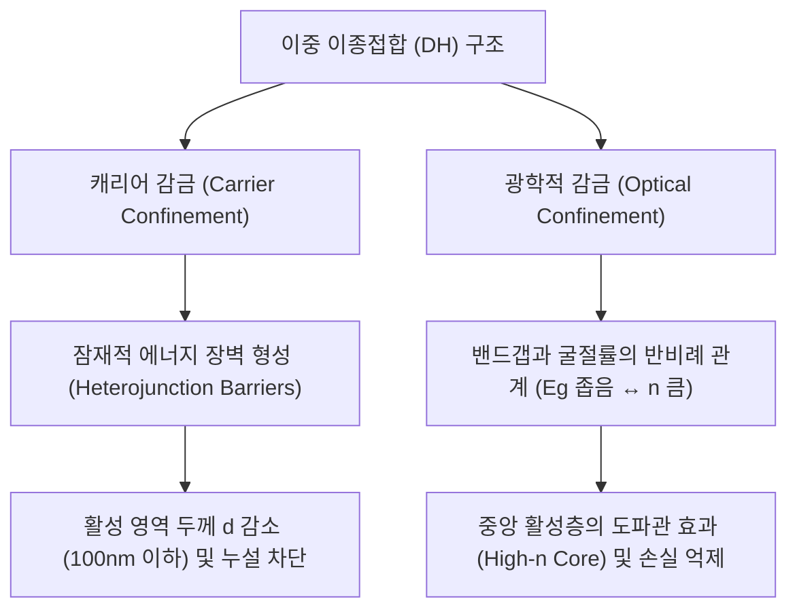

유튜브 강의 영상 자막의 한글 번역본입니다.

### 강의 동영상

<iframe width="100%" height="400" src="https://www.youtube.com/embed/SLjfKexs7-0" frameborder="0" allow="accelerometer; autoplay; clipboard-write; encrypted-media; gyroscope; picture-in-picture" allowfullscreen></iframe>

---

### 강의 해설 및 보충 설명 (Lecture Analysis)

본 강의는 반도체 레이저 및 발광 다이오드(LED)의 임계 전류를 획기적으로 낮춘 **이중 이종접합(Double Heterostructure, DH)**의 물리적 원리와 그 한계를 극복하기 위해 제안된 **저차원 나노 구조(양자 우물, 양자선, 양자점)**의 광학적 이점에 대해 다룹니다.

---

#### 1. 반도체 레이저의 임계 조건: 버나드-뒤라푸르 조건 (Bernard-Duraffourg Condition)

원자 레이저 시스템에서의 인구 역전 조건이 상위 에너지 준위와 하위 에너지 준위의 캐리어 수 차이 $N_2 - N_1 > 0$으로 정의되는 것과 달리, 반도체는 연속적인 에너지 대역(Energy Band)을 가집니다. 따라서 반도체 내에서 광학적 이득(Gain)이 흡수(Loss)를 초과하여 발진을 시작하려면 다음과 같은 **버나드-뒤라푸르 조건(Bernard-Duraffourg Condition)**을 만족해야 합니다.

$$F_N - F_P > h\nu > E_g$$

여기서 $F_N$과 $F_P$는 각각 전자와 홀의 준페르미 준위(quasi-Fermi levels)이며, $h\nu$는 입사되거나 방출되는 광자의 에너지, $E_g$는 반도체의 밴드갭(Bandgap) 에너지입니다. 준페르미 준위의 분리 정도가 광자 에너지보다 커야만 유도 방출 확률이 흡수 확률보다 커지게 되며, 밴드갭 이하의 영역에서는 상태 밀도가 존재하지 않으므로 어떠한 광학적 전이도 일어날 수 없습니다.

---

#### 2. 캐리어 농도와 준페르미 준위의 수학적 관계

주입된 전자의 부피 밀도 $n$과 홀의 부피 밀도 $p$는 각각 전도대와 가전자대의 상태 밀도(Density of States, DOS)와 페르미-디랙 분포 함수의 곱을 적분하여 구합니다. 3차원 벌크 반도체의 전도대 상태 밀도 $g_c(E)$는 다음과 같이 주어집니다.

$$g_c(E) = \frac{1}{2\pi^2} \left(\frac{2m_e^*}{\hbar^2}\right)^{3/2} \sqrt{E - E_c}$$

이를 통해 전도대 내의 총 전자 밀도 $n$을 적분식으로 표현하면 다음과 같습니다.

$$n = \int_{E_c}^{\infty} g_c(E) f_n(E) dE = \int_{E_c}^{\infty} \frac{1}{2\pi^2} \left(\frac{2m_e^*}{\hbar^2}\right)^{3/2} \sqrt{E - E_c} \cdot \frac{1}{1 + e^{\frac{E - F_N}{k_B T}}} dE$$

이 적분은 무차원 변수 $x = (E - E_c)/k_B T$와 $\eta = (F_N - E_c)/k_B T$를 사용하여 **페르미-디랙 적분(Fermi-Dirac Integral)** 형태로 치환하여 수치적으로 계산합니다.

전하 중성 조건(Charge Neutrality)에 의해 다이오드에 주입된 전자 밀도 $n$과 홀 밀도 $p$는 대략적으로 같아야 합니다. 그러나 갈륨 비소(GaAs)의 경우 전자의 유효 질량($m_e^* \approx 0.067 m_0$)이 홀의 유효 질량($m_h^* \approx 0.4 m_0$)보다 훨씬 작기 때문에, 전도대의 상태 밀도 양동이가 가전자대보다 훨씬 좁습니다. 결과적으로 동일한 캐리어 농도를 주입하더라도 전자의 준페르미 준위 $F_N$이 홀의 준페르미 준위 $F_P$보다 전도대 내부로 훨씬 빠르고 깊게 상승하게 됩니다. 

일반적으로 상온에서 반도체 레이저가 임계 이득을 얻기 위해 필요한 임계 캐리어 농도($n_{th}, p_{th}$)는 반도체의 종류에 따라 다르지만 대략 $10^{18} \sim 10^{19} \text{ cm}^{-3}$ 수준에 달합니다.

---

#### 3. 임계 전류 밀도와 속도 방정식 및 온도 의존성

활성 영역의 부피 내에서 캐리어 밀도의 시간적 변화는 주입 생성률 $G$와 재결합 소멸율의 차이로 결정되는 속도 방정식(Rate Equation)으로 나타낼 수 있습니다.

$$\frac{dn}{dt} = G - \beta n p$$

여기서 $\beta$는 자발 방출 재결합 계수(spontaneous recombination coefficient)입니다. 정상 상태(Steady State, $dn/dt = 0$) 조건 하에서 생성률은 재결합률과 균형을 이룹니다.

$$G = \beta n p$$

이 생성률을 유지하기 위해 외부에서 주입해야 하는 임계 전류 밀도 $J_{th}$는 다음과 같은 관계로 주어집니다.

$$J_{th} = \frac{e \cdot d \cdot n_{th}}{\tau}$$

여기서 $e$는 기본 전하량, $d$는 활성 영역의 두께, $\tau$는 캐리어의 재결합 수명(Lifetime)입니다. 
동종접합(Homojunction) 다이오드 레이저에서는 주입된 캐리어가 퍼져 나가는 활성 영역의 두께 $d$가 대략 $1\text{ }\mu\text{m}$ 수준으로 꽤 두껍습니다. 이로 인해 임계 동작에 필요한 임계 전류 밀도가 $50 \sim 100 \text{ kA/cm}^2$에 달하게 됩니다.

이처럼 높은 임계 전류 밀도는 소자 내부에서 극심한 $I^2 R$ 줄 열(Joule heating) 손실을 발생시키며 온도를 급격히 상승시킵니다. 온도가 오르면 페르미-디랙 분포가 완만해져 이득 계수의 최댓값이 감소하므로, 감소한 이득을 보충하기 위해 더 많은 캐리어를 주입해야 하는 악순환이 발생합니다. 반도체 레이저의 임계 전류 밀도 $J_{th}$의 온도 의존성은 다음과 같은 지수 함수적 거동을 보입니다.

$$J_{th}(T) = J_0 \exp\left(\frac{T}{T_0}\right)$$

여기서 $T_0$는 온도 안정성을 나타내는 특성 온도(characteristic temperature)입니다. 동종접합 레이저는 $T_0$가 낮아 상온에서 연속파(CW) 동작 시 소자가 즉각적으로 파괴되는 치명적인 한계를 가졌습니다.

---

#### 4. 이중 이종접합(Double Heterostructure, DH) 레이저의 동작 원리

이중 이종접합(DH) 구조는 활성 영역의 양옆에 밴드갭이 더 넓은 반도체 장벽층을 배치하는 구조로, 상온 연속 동작을 가능케 한 광전자학의 혁명이었습니다. 이 구조는 두 가지 핵심 감금 효과를 동시에 유도합니다.



1. **캐리어 감금 (Carrier Confinement)**: 좁은 밴드갭 활성 영역을 둘러싼 이종접합의 에너지 장벽이 전자와 홀의 이동을 제한합니다. 양자역학적인 포텐셜 우물이 형성되어 주입된 캐리어가 활성 영역 밖으로 빠져나가지 못하고 갇히게 되므로 $d$를 $100\text{ nm}$ 이하로 줄여도 재결합 효율이 저하되지 않으며, 부피 감소에 비례해 임계 전류 밀도가 10배 이상 감소합니다.
2. **광학적 감금 (Optical Confinement)**: 반도체 물리 법칙에 따라 **밴드갭이 좁은 물질일수록 굴절률(index of refraction, $n$)이 큽니다.** 예컨대 밴드갭이 $1.4\text{ eV}$인 GaAs의 굴절률은 $3.5$인 반면, 밴드갭이 $3.0\text{ eV}$인 AlAs의 굴절률은 $3.0$입니다. 이로 인해 중앙의 활성 영역은 주변 영역보다 높은 굴절률을 가지는 광도파관(waveguide)의 코어(core) 역할을 하게 되며, 방출된 빛을 중앙에 가두어 광학 손실을 극적으로 줄입니다.

이러한 혁신적인 개념을 제안한 **조레스 알페로프(Zhores Alferov)**와 **허버트 크뢰머(Herbert Kroemer)**는 그 공로를 인정받아 **2000년 노벨 물리학상**을 수상하였습니다.

---

#### 5. 저차원 구조로의 발전과 결합 상태 밀도 (Joint Density of States)의 설계

에피택셜 성장(MBE, MOCVD 등) 기술의 비약적인 발전으로 활성 영역의 두께를 캐리어의 드브로이 파장(de Broglie wavelength, $\approx 10\text{ nm}$) 수준까지 얇게 조절할 수 있게 되면서, 차원 감소에 따른 양자 감금 효과(Quantum Confinement)가 나타나기 시작했습니다.

차원이 감소함에 따라 에너지에 따른 결합 상태 밀도(Joint Density of States, JDOS)의 형태가 극적으로 변합니다.

```mermaid
classDef default fill:#f9f9f9,stroke:#333,stroke-width:1px;
classDef highlight fill:#e1f5fe,stroke:#0288d1,stroke-width:2px;

graph LR
    subgraph Dimension_Lowering ["차원 감소에 따른 상태 밀도 변화"]
        D3["3D bulk<br/>(Continuous)"] --- D2["2D quantum well<br/>(Staircase)"]
        D2 --- D1["1D quantum wire<br/>(Peaked)"]
        D1 --- D0["0D quantum dot<br/>(Delta Functions)"]
    end

    class D0 highlight;
```

* **3D 벌크**: 연속적인 제곱근 비례 거동을 보입니다.
  $$\rho_{JDOS}^{3D}(h\nu) \propto \sqrt{h\nu - E_g}$$
* **2D 양자 우물 (Quantum Well)**: 한 방향의 두께가 매우 얇아져 이 방향으로 정상파(standing wave)가 형성됩니다. 전도대와 가전자대에 불연속적인 서브밴드(subband)가 형성되며, 상태 밀도는 계단형 함수(staircase function)의 형태를 가집니다.
  $$\rho_{JDOS}^{2D}(E) = \sum_n \frac{m_r^*}{\pi\hbar^2} \theta(E - E_n)$$
* **1D 양자선 (Quantum Wire)**: 두 방향으로 감금되어 단 한 방향으로만 자유롭게 움직입니다. 상태 밀도는 각 서브밴드 가장자리에서 무한대로 발산하는 특이한 형태를 취합니다.
  $$\rho_{JDOS}^{1D}(E) \propto \frac{1}{\sqrt{E - E_n}}$$
* **0D 양자점 (Quantum Dot)**: 모든 3차원 방향으로 움직임이 제한되어 전자들이 마치 고립된 원자처럼 완전히 이산적인(discrete) 에너지 준위만을 갖게 됩니다.
  $$\rho_{JDOS}^{0D}(E) \propto \delta(E - E_n)$$

상태 밀도가 단일 에너지 준위에 고도로 집중되는 0D 양자점 구조로 갈수록, 불필요한 주입 캐리어 소모가 차단되어 최소한의 임계 전류 밀도($20 \text{ A/cm}^2$ 이하)로 최대의 피크 이득을 유도할 수 있어 에너지 효율을 극대화할 수 있습니다.

---

### 강의 자막 직역본

<details>
<summary><b>[00:00 - 15:00] 자막 번역 보기</b></summary>
<div markdown="1">

[00:00] 좋습니다. 이제 조를 짜고 편한 시간을 결정하셨다면, 배포 중인 서명지에 이름을 기재해 주시기 바랍니다. 이 수업의 두 가지 실험을 위해 이름의 첫 이니셜과 성을 적어주시면 됩니다. 첫 번째 실험은 반도체 양자 우물 구조(quantum well structure)를 측정하는 것입니다. 자발 방출 수명(spontaneous lifetime)을 측정할 예정입니다. 어제 반도체 레이저 다이오드를 설치하여 준비를 마쳤는데, 출력을 지나치게 높여서 소자가 타버렸습니다. 하지만 새로 하나를 구했고, 블라드(Vlad)가 설정을 돕고 있습니다. 여러분은 소자의 임계값(threshold)과 주입 전류 대 출력(L-I) 곡선을 측정하게 될 것입니다.

[01:01] 이것이 첫 번째 실험의 내용입니다. 두 번째 실험은 설계에 더 치중한 실험으로, 추수감사절(Thanksgiving) 연휴 이후에 진행됩니다. 다음 주 월요일 수업에 클리프 폴록(Cliff Pollock) 교수님께서 오셔서 이 실험에 대해 설명해 주실 것입니다. 거기서 여러분은 거울과 이득 매질(gain medium) 등을 사용하여 실제 테이블탑 레이저(tabletop laser)를 구축하게 됩니다. 이것이 두 실험의 대략적인 개요입니다. 아직 조를 정하지 못하신 분들은 서명지가 돌아갈 때 시간을 확인하고 이름을 적으시면 자동으로 조가 구성됩니다. 내일 이른 아침에 실험 안내서를 보낼 테니 보고서 준비에 참고하시기 바랍니다. 보고서는 조별로 하나의 보고서를 제출하며, 일반 과제와는 별개로 아마도 추수감사절 이후에 마감될 것입니다.

[02:02] 추수감사절 연휴 기간 중에는 진행하지 않습니다. 네, 좋습니다. 이에 대해 질문이 있으신가요? 질문이 없다면 서명해주시기 바라며, 우리가 그동안 이야기해 온 내용들을 실제 현장에서 직접 확인해보는 계기가 되기를 바랍니다. 아, 그리고 두 실험의 장소에 대해 말씀드리자면, 첫 번째 실험은 더필드 홀(Duffield Hall)에서, 두 번째 실험은 필립스 홀(Phillips Hall)에서 진행될 것입니다. 장소 등에 대한 구체적인 내용은 다시 안내해 드리겠습니다. 이제 본론으로 돌아와서 반도체 레이저에 대한 이해를 넓혀가고자 합니다. 지난 수업에서 언급했듯이, 오늘날 단순한 PN 다이오드만을 사용하여 반도체 레이저를 만드는 사람은 거의 없습니다. 우리 모두 양자 우물(quantum wells), 양자...

[03:03] 양자점(quantum dots) 같은 저차원 구조를 사용합니다. 오늘 먼저 다루고 싶은 주제는 왜 저차원 구조로 가야 하는지, 왜 최대 이득을 얻고 임계 전류(threshold current)를 최소화하기 위해 소자를 완전히 양자역학적으로 설계해야 하는지에 대한 동기 부여입니다. 일단 저차원 구조로 가게 되면, 이러한 저차원 양자화 헤테로 구조(quantized heterostructures)를 사용할 때의 여러 추가적인 장점들이 있다는 것을 알게 됩니다. 따라서 먼저 그 이유를 짚어본 뒤, 실제로 이를 어떻게 구현하는지 살펴보겠습니다. 지난 시간에 논의한 내용 중 하나는 반도체 매질(아직 레이저가 아닌 상태)의 이득 스펙트럼(gain spectrum)이었습니다. 우리가 본 것처럼 아인슈타인 A 계수(Einstein A coefficient), 파장, 그리고 굴절률 등이 다음과 같이 나타납니다.

[04:04] 이어서 결합 상태 밀도(joint density of states)가 나타나는데, 이는 벌크(bulk)에서 저차원으로 전환될 때 엔지니어링할 수 있는 매우 중요한 물리량입니다. 저차원으로 가면 다른 요소들은 대체로 유사하지만, 이 결합 상태 밀도가 아주 크게 변화합니다. 그리고 전도대의 높은 에너지($E_2$) 상태의 페르미 함수에서 가전자대의 ($E_1$) 상태의 페르미 함수를 뺀 인구 역전(population inversion) 인자가 있습니다. 이것이 인구 역전 항이며, 외부 배터리를 통해 인가된 작은 전압으로 이 두 가지 페르미 함수를 제어하게 됩니다. 이를 통해 준페르미 준위(quasi-Fermi levels)를 갈라놓을 수 있습니다. 반도체가 열평형 상태(equilibrium)에 있을 때는 이 값이 $0$과 $1$이 되어 이득 계수가 음수(-)가 되며, 이는 빛을 흡수함을 의미합니다. 하지만 캐리어를 주입하기 시작하면...

[05:04] 지난 시간 시뮬레이션에서 보았듯이 인구 역전 항을 $-1$에서 $+1$ 근처로 뒤집을 수 있습니다. 부호가 양수(+)로 바뀌면 손실(loss) 상태에서 이득(gain) 상태로 전환됩니다. 충분한 캐리어를 주입하면 이득을 얻게 되며, 이러한 현상이 일어나는 임계 조건(threshold condition)은 지난 시간에 유도했듯이 전자와 홀의 준페르미 준위 차이($F_N - F_P$)가 광자 에너지 $h\nu$보다 커질 때입니다. 그리고 이 에너지는 밴드갭(bandgap) 에너지 역시 초과해야 합니다. 밴드갭 이하의 에너지에서는 흡수나 방출을 일으킬 상태가 없기 때문입니다. 이것이 반도체의 레이저 임계 조건이며, 원자 시스템에서의 $N_2 - N_1 > 0$ 조건과 본질적으로 유사하지만, 반도체에서는 에너지 밴드가 존재하므로 이러한 세부 사항들이 가미됩니다. 이 임계 조건은...

[06:05] 버나드와 뒤라푸르(Bernard and Duraffourg)에 의해 최초로 유도되었기 때문에, 이들의 이름을 따서 버나드-뒤라푸르 임계 조건(Bernard-Duraffourg condition)이라고 부릅니다. 이 조건은 1960년대 초 여러 연구 그룹에 의해 반도체 동종접합(homojunction) 레이저를 설계하고 실증하는 데 즉각적으로 활용되었습니다. 오늘 이에 대해 설명하겠습니다. 우리가 $F_N$과 $F_P$를 증가시킨다는 것은 실질적으로 전자를 주입하여 전자의 준페르미 준위 $F_N$을 위로 끌어올리는 것을 의미합니다. 만약 이것이 전도대(conduction band)의 상태 밀도 분포이고, 이것이 밴드갭이며, 여기가 가전자대(valence band)와 전도대의 가장자리(edges)라고 해봅시다. 외부 자극이 없는 열평형 상태에서는 페르미 준위가 보통 밴드갭 중앙 부근에 위치합니다.

[07:07] 하지만 여분의 전자를 주입함에 따라 전자의 준페르미 준위인 $F_N$이 위로 끌어올려져 전도대에 점점 가까워집니다. 마찬가지로 홀(holes)을 더 주입하면 가전자대 측의 준페르미 준위인 $F_P$가 아래로 내려갑니다. (죄송합니다. $F_N$은 전자를 위한 것이고 $F_P$는 홀을 위한 것입니다.) 이렇게 양쪽 준페르미 준위가 갈라져서 그 차이가 밴드갭보다 커지게 되면 이득을 얻기 시작합니다. 준페르미 준위 $F_N$을 이 정도로 올리면 이 상태들을 전자로 채우게 되고, 본래 완전히 채워져 있던 가전자대에서 $F_P$를 아래로 내려 이 상태들을 비우게 됩니다. 그 결과 전도대에는 전자가 존재하고 가전자대에는 비어 있는 상태(홀)가 존재하게 되어 인구 역전(population inversion)이 발생합니다. 이것이 대략적인 메커니즘이며, 우리는...

[08:08] 정량적인 분석을 해보았고, 이번 과제에서도 이 문제를 풀게 될 것입니다. 예를 들어 전류 주입이 전혀 없다면, 밴드갭이 $1.4\text{ eV}$인 반도체(예: 갈륨 비소, GaAs)에서 $F_N$과 $F_P$는 모두 밴드갭 중앙인 $0.7\text{ eV}$에 위치하게 됩니다. 이 상태에서 계산해 보면 이득 계수가 음수(-) 값을 가집니다. 즉, 갈륨 비소의 경우 충분히 큰 광자 에너지에 대해 약 $4,000\text{ cm}^{-1}$의 음의 흡수 계수(absorption coefficient)를 가집니다. 다만 밴드 가장자리 부근에서는 그 값이 더 작습니다. 이것이 의미하는 바는, 만약 이 반도체에 빛이 입사하고 입사면에서의 초기 광강도가 $I(0)$라면...

[09:10] 두께가 $L$인 반도체 매질을 통과하여 반대편으로 나오는 빛의 강도는 $I(L) = I(0) e^{\gamma_0(\nu) L}$이 된다는 것입니다. 이 조건에서는 이득 계수 $\gamma_0$가 큰 음수 값을 가집므로 빛이 흡수(absorption)됩니다. 이는 광검출기(photodetector)나 태양전지(solar cell)와 같이 광자를 흡수해야 하는 모든 소자의 핵심 원리입니다. 효율적인 태양전지를 만들기 위해 반도체의 부피를 줄이려면 흡수 계수가 매우 높아야 하며, 즉 매우 큰 음의 이득 계수가 필요합니다. 흡수 계수는 전도대 점유 확률을 $0$으로, 가전자대 점유 확률을 $1$로 두었을 때의 값에 해당합니다. 이제 캐리어를 주입했을 때 광자 에너지에 따른 이득 계수를 다시 그려보겠습니다.

[10:11] 가로축을 광자 에너지로 두고 임계 밴드갭 부근에서 그리기 시작합니다. 캐리어를 주입함에 따라 전도대 점유 확률은 $0$에서 $0.8$로 올라고 가전자대 점유 확률은 $1$에서 $0.1$로 내려가는 식으로 거동이 바뀝니다. 주입량을 점점 늘리면 곡선이 위로 올라가게 되며, 어느 시점에 이르면 이득(gain)을 얻는 작은 윈도우(window) 구간이 나타납니다. 이 주파수 구간을 넘어서면 여전히 손실(loss)이 발생합니다. 이득이 $0$이 되는 부근의 에너지는 정확히 준페르미 준위의 차이 $F_N - F_P$와 같습니다. 따라서 조금이라도 이득을 얻기 위해서는 준페르미 준위 차이 $F_N - F_P$가 최소한 밴드갭 에너지보다 커야 하는 이유를 알 수 있습니다.

[11:12] 밴드갭 이하의 에너지에서는 상태 밀도(density of states)가 전혀 존재하지 않기 때문에 광자가 반도체와 상호작용하지 못합니다. 흥미로운 점은 밴드갭보다 작은 주파수의 빛이 입사하면 흡수가 일어나지 않고 그대로 통과한다는 것입니다. 반면 PN 다이오드를 통해 많은 캐리어가 주입되어 이득 윈도우 내에 주파수가 위치하면 이득을 얻게 되므로, 입사된 것보다 더 많은 광자가 방출되어 나옵니다. 그러나 정확히 이 지점에 위치하면, 광자 에너지가 반도체의 밴드갭보다 큼에도 불구하고 광학적으로 투명한 상태(optically transparent)가 됩니다. 이득 계수가 양수와 음수 사이인 $0$이 되기 때문입니다. 이를 주입 유도 투명성(injection-induced transparency)이라고 부릅니다. 이 구간을 벗어나 더 높은 에너지를 가지면 다시 흡수됩니다.

[12:14] 그보다 높은 주파수에서는 빛이 다시 흡수됩니다. 이처럼 이득 계수를 통해 반도체의 광학적 거동을 이해할 수 있습니다. 덧붙여 말씀드리면, 실제 갈륨 비소와 같은 반도체에는 다른 에너지 밴드들이 얽혀 있어 밴드 구조의 세부 사항들이 추가되지만, 여기서는 모델을 다소 단순화하여 설명했습니다. 그러나 이 수업에서 주로 다루는 이득 윈도우 영역 안에서는 이 간단한 모델이 꽤 정확하게 들어맞습니다. 그리고 한 가지 짚고 넘어갈 점은, 이 시뮬레이션 그래프에서 파란색 곡선은 저온(low temperature)에서의 이득 계수를 나타냅니다. 즉 전자의 준페르미 준위 $F_N$을 전도대 내부로 밀어 넣고, 가전자대(여기서는 에너지 축에서 아래쪽 방향) 측에도 홀의 준페르미 준위를 밀어 넣은 상태입니다.

[13:14] 가전자대 내부로 약 $50\text{ meV}$ 내지 $60\text{ meV}$만큼 침투해 들어갔다고 가정해 봅시다. 그래프에 표기된 $0.062\text{ eV}$는 $62\text{ meV}$를 의미합니다. 전도대 측의 전자의 준페르미 준위 $F_N$은 밴드갭이 $1.4\text{ eV}$일 때 약 $46\text{ meV}$ 정도 올라가 있습니다. 전하 중성 조건(charge neutrality)에 의해 주입된 전자와 홀의 수는 같지만, 전도대의 상태 밀도가 가전자대보다 훨씬 작기 때문에(즉, 전도대가 훨씬 좁은 양동이인 셈이므로) 전자의 준페르미 준위 $F_N$이 훨씬 더 빠르게 전도대 내부로 상승하게 됩니다. 따라서 이 값을 조금 더 높여보면 보다 현실적인 상황에 가까워집니다.

[14:15] 이제 전도대 측에서 약 $100\text{ meV}$ 수준에 도달했고, 파란색으로 표시된 $77\text{ K}$ 저온 이득 스펙트럼을 확인할 수 있습니다. 이 특정 윈도우 내에서만 이득이 발생하고 그 외에는 손실이 일어납니다. 빨간색은 상온(room temperature)에서의 이득 스펙트럼입니다. 흥미롭게도 저온과 상온 곡선 모두 투명도 지점(transparency point)에서 이득 계수가 $0$이 되며, 이는 이득 방정식으로부터 수학적으로 증명할 수 있습니다. 밴드 가장자리와 투명도 지점에서 모두 $0$이 됩니다. 또한 저온일수록 이득의 최댓값(peak gain)이 더 크다는 것을 알 수 있습니다. 이 점을 잘 기억해 두시기 바랍니다. 왜냐하면 이것이 단순한 3D 벌크 구조를 벗어나 저차원 구조로 가려는 강력한 동기이기 때문입니다. 이 그래프는 결합 상태 밀도가 3차원인 경우의 결과입니다.

</div>
</details>

<details>
<summary><b>[15:00 - 30:00] 자막 번역 보기</b></summary>
<div markdown="1">

[15:17] 지난 시간에 주파수의 함수로서 결합 상태 밀도를 유도했었습니다. 그 값은 $\frac{1}{2\pi^2} \left(\frac{2m_r^*}{\hbar^2}\right)^{3/2} \sqrt{h\nu - E_g}$의 형태를 가집니다. 여기서 $m_r^*$은 전도대와 가전자대의 유효 질량 세부 정보를 포함하는 환산 유효 질량(reduced effective mass)입니다. 이것이 우리가 유도했던 식이며, 캐리어가 모든 3차원 방향으로 자유롭게 움직일 수 있는 3차원 벌크 반도체의 특징입니다. 이제 준페르미 준위의 목표 위치가 정해졌으므로, 이 임계 조건을 충족하기 위해 얼마나 많은 주입 전류 또는 전류 밀도가 필요한지 간단히 계산해 보겠습니다. 3차원 벌크 구조의 경우 임계 전류가 매우 높게 나타나며, 이는 몇 가지 다른 물리적 문제를 야기합니다.

[16:20] 일반적으로 임계 전류 밀도가 $50\text{ kA/cm}^2$ 내지 $100\text{ kA/cm}^2$에 달합니다. 이 정도 전류 밀도는 적절한 전원 장치로 인가할 수 있지만, 전류가 너무 높기 때문에 $I^2 R$ 발열 손실로 인해 소자가 심하게 가열됩니다. 벌크 반도체가 가열되면 이득 계수가 크게 저하됩니다. 저온($77\text{ K}$)과 상온 스펙트럼에서 보았듯이 온도가 올라가면 이득이 감소하는데, 이 정도의 대전류를 주입하면 소자 내부 온도는 상온이 아니라 $100^\circ\text{C}$나 $150^\circ\text{C}$까지 상승하게 됩니다. 온도가 오르면 임계 전류가 더욱 상승하는 악순환이 발생합니다. 이에 반해 저차원 구조로 가게 되면 온도 변화에 훨씬 더 강인해지고 임계 전류도 낮아집니다. 대략 차원을 한 단계 낮출 때마다(3D 벌크에서 2D 양자 우물로 갈 때) 임계 전류가 약 10배씩 감소하는 효과가 있습니다.

[17:22] 양자 우물(2D)에서 양자선(1D, quantum wires), 그리고 양자점(0D, quantum dots)으로 내려갈 때마다 추가로 10배씩 더 감소합니다. 그 이유는 곧 살펴보겠지만 3차원 상태 밀도가 에너지의 제곱근 형태($\sqrt{E}$)로 완만하게 증가하기 때문입니다. 반면 2차원으로 가면 결합 상태 밀도가 계단 모양(staircase function)의 형태를 띠게 되며, 양자 감금 효과에 의한 에너지 천이(shift)가 발생하게 됩니다. 1차원으로 가면 $1/\sqrt{E}$ 형태의 날카로운 피크가 나타나고, 0D 양자점으로 가면 원자와 같이 불연속적이고 매우 날카로운 선 스펙트럼을 보입니다. 이로 인해 특정 주파수 영역에서 저차원 구조가 매우 큰 이점을 가지게 됨을 오늘 배울 것입니다. 그렇다면 반도체 레이저를 작동시키기 위해 필요한 임계 전류 밀도를 정량적으로 추정해 보겠습니다.

[18:22] 이 버나드-뒤라푸르 임계 조건을 만족하기 위한 대략적인 수치 범위를 알아보겠습니다. 전도대에 존재하는 전자의 밀도 $n$은 전도대 상태 밀도 $g_c(E)$와 페르미-디랙 점유 함수 $f(E)$의 곱을 적분하여 얻어집니다. 3차원 전도대 상태 밀도식은 $\frac{1}{2\pi^2} \left(\frac{2m_e^*}{\hbar^2}\right)^{3/2} \sqrt{E - E_c}$와 같이 쓸 수 있습니다. 여기서 $m_e^*$는 전도대 전자의 유효 질량이고, $E_c$는 전도대 하단 에너지입니다. 전도대 하단으로부터 얼마나 높은 에너지를 가지는지에 따른 제곱근 형태의 거동입니다.

[19:25] 이것이 3차원 상태 밀도식입니다. 점유 확률을 나타내는 페르미-디랙 분포 함수는 $f_n(E) = \frac{1}{1 + e^{(E - F_N)/k_B T}}$로 주어집니다. 전체 전자 밀도를 얻으려면 이 상태 밀도와 페르미 함수의 곱에 $dE$를 곱해 전도대 전체 에너지 영역에 대해 적분해야 합니다. 고체물리학이나 반도체 소자 기초 과목을 수강하신 분들이라면 익숙한 공식일 것입니다. 일반적으로 전도대 하단 $E_c$부터 밴드 상단까지 적분하게 됩니다.

[20:27] 하지만 페르미 함수가 높은 에너지 영역에서 $k_B T$의 스케일로 매우 빠르게 지수적으로 감쇄하므로, 적분의 상한을 무한대($\infty$)로 두어도 오차가 거의 없습니다. 이 적분식을 정리하고 변수 치환 등을 적용하면 해석적으로 풀 수 없는 형태의 페르미-디랙 적분(Fermi-Dirac integral)이 유도되며, 수치적으로 계산해야 합니다. 유도된 전자의 부피 밀도 $n$과 가전자대 내의 홀의 부피 밀도 $p$는 외부 인가 전압에 따른 $F_N$과 $F_P$의 함수로 나타낼 수 있습니다. 이를 통해 준페르미 준위 차이에 따라 $n$과 $p$가 어떻게 변하는지 추적할 수 있습니다.

[21:27] MATLAB이나 Mathematica를 이용해 수치 계산을 해보면, 준페르미 준위가 전도대 아래 멀리 있는 경우($E_c - F_N = 6.9 k_B T$) 전자 밀도는 약 $10^{14}\text{ cm}^{-3}$ 수준으로 매우 낮습니다. 그러나 준페르미 준위가 올라가 $E_c - F_N$이 음수(-)가 되어 $F_N$이 전도대 내부로 침투하면, 전자 밀도가 $10^{19}\text{ cm}^{-3}$ 차수까지 급격히 상승합니다. 임계 조건의 대략적인 기준은 준페르미 준위가 전도대와 가전자대 내부로 들어가는 시점이며, 반도체의 종류에 따라 차이가 있지만 보통 $10^{18}\text{ cm}^{-3}$ 내지 $10^{19}\text{ cm}^{-3}$ 수준의 캐리어 밀도가 요구됩니다.

[22:30] 이 테이블은 홀에 대해서도 유사한 경향을 보여줍니다. 여기서 적분 변수 $x$는 대략 $(E - E_c)/k_B T$와 같은 무차원수(dimensionless quantity)이며, 적분 내부의 $\sqrt{E - E_c}$와 $dE$ 항을 이 무차원 변수 $x$로 치환하여 정리한 것입니다. 교재에서 발췌한 수식인데, 전자의 경우 $x = (E - E_c)/k_B T$로 치환하면 분모에는 $\exp(x - \eta)$ 형태가 나타나고 분자에는 $\sqrt{x}$가 포함되는 형태가 됩니다.

[23:31] 이와 같이 전도대의 전자 밀도를 구하여 임계 캐리어 농도를 예측할 수 있습니다. 이제 이처럼 높은 농도의 캐리어를 반도체 접합부에 유지하기 위해 흘려주어야 하는 대략적인 전류량을 유도해 보겠습니다. PN 다이오드 접합부의 활성 영역(active region)을 두께가 $d$(약 $1\text{ }\mu\text{m}$), 폭이 $W$, 길이가 $L$인 직육면체 윈도우로 가정하겠습니다. 이 윈도우 내부에서 빛의 흡수, 이득, 임계 동작 등의 광학적 활성 현상이 대부분 일어납니다.

[24:33] 이 활성 영역에 임계 캐리어 밀도를 유지하기 위해 지속적으로 전류를 주입해야 합니다. 전자의 준페르미 준위 $F_N$과 전자 밀도 $n$, 그리고 홀의 준페르미 준위 $F_P$와 홀 밀도 $p$ 사이의 관계를 통해 어떻게 준페르미 준위 차이 $F_N - F_P$를 밴드갭보다 크게 만들 수 있는지 분석해 보면, 앞서 언급한 캐리어 농도 조건들이 도출됩니다. 반도체의 물성과 유효 질량, 밴드갭에 따라 수치가 달라지지만 이와 같은 관계가 성립합니다.

[25:33] 따라서 준페르미 준위 차이가 밴드갭보다 커져 임계 조건에 도달할 때의 전자 농도 $n$과 홀 농도 $p$를 구할 수 있습니다. 다이오드에 전기적으로 캐리어를 주입할 때 이들이 거동하는 방식에 대해 질문이 있었는데, 전도대와 가전자대의 상태 밀도 비율에 따라 서로 다른 거동을 보입니다.

[26:35] 다이오드 주입 시 전기적 중성 조건(neutrality condition)에 의해 활성 영역에 주입되는 전자의 수와 홀의 수는 항상 같아야 합니다. 그런데 가전자대(holes)의 상태 밀도가 전도대(electrons)보다 훨씬 높습니다. 이로 인해 주입량이 증가할 때 전자의 준페르미 준위 $F_N$이 전도대 내부로 훨씬 빠르게 상승합니다. 동일한 캐리어 농도를 맞추기 위해 가전자대보다 전도대 측의 페르미 준위가 밴드 가장자리로부터 더 깊이 파고들어야 하기 때문입니다. 이는 전도대와 가전자대 유효 질량의 비에 기인합니다. 예컨대 갈륨 비소(GaAs)의 경우 홀의 유효 질량은 약 $0.4 m_0$인 반면, 전자의 유효 질량은 $0.067 m_0$로 약 6~7배 차이가 납니다.

[27:37] 하지만 인장 및 압축 응력(strain)을 이용한 밴드 엔지니어링을 통해 밴드 구조를 변형하고 두 유효 질량을 비슷하게 설계할 수도 있습니다. 유효 질량이 같아지면 준페르미 준위의 이동량도 대칭을 이룹니다. 유효 질량에 대칭성이 없는 일반적인 경우에는 전자의 페르미 준위가 홀보다 밴드 내로 더 깊이 들어갑니다. 다이오드 양단에 주입을 위해 인가해야 하는 전압 차이는 이 준페르미 준위들의 차이로 결정됩니다. 먼저 임계 동작에 필요한 전류량 계산을 마무리한 뒤 이 논의로 돌아오겠습니다.

[28:38] 임계치 도달에 필요한 전류를 구하는 정량적 유도를 해봅시다. 반도체 매질로 유입되는 전류는 활성 영역 내부의 캐리어(전자) 총전하량을 특성 수명(lifetime)으로 나눈 값과 같습니다. 즉, 주입 전류 $I = \frac{Q}{\tau} = \frac{e \cdot n \cdot (W \cdot L \cdot d)}{\tau}$로 표현할 수 있습니다. 여기서 $W \cdot L \cdot d$는 활성 영역의 부피이며, 왜 소자 전체가 아닌 활성 영역 두께 $d$만을 고려하는지는 곧 설명하겠습니다. $\tau$는 캐리어가 소멸하는 시간 상수입니다.

[29:39] 우리가 주입한 전자는 가전자대의 홀과 재결합하여 광자를 방출하며 소멸하며, 이 과정의 특성 시간을 재결합 수명(recombination lifetime, $\tau$)이라고 합니다. 주입 전류 $I$를 단면적 $W \cdot L$로 나누면 전류 밀도 $J$를 얻을 수 있습니다. 따라서 전류 밀도는 $J = \frac{e \cdot d \cdot n}{\tau}$로 나타납니다. 양쪽에서 주입된 전자와 홀이 두께 $d$의 영역에서 재결합하여 빛을 방출하는 모델입니다. 단위를 대입해 보면 [Coulomb] $\times$ [cm] $\times$ [$\text{cm}^{-3}$] / [second] = [$\text{A/cm}^2$]로 전류 밀도의 단위와 일치합니다.

</div>
</details>

<details>
<summary><b>[30:00 - 45:00] 자막 번역 보기</b></summary>
<div markdown="1">

[30:42] 따라서 반도체 소자에서 널리 쓰이는 $\text{A/cm}^2$ 단위의 전류 밀도 식을 얻게 됩니다. 전도대에 추가적인 전자와 가전자대에 추가적인 홀이 주입되면, 이들은 영구히 머무르는 것이 아니라 광자를 방출하며 재결합(recombination)을 일으킵니다. $E-k$ 공간에서 살펴보면 주입된 전자와 홀이 $1/\tau$의 속도로 재결합하여 소멸합니다. 활성 영역 내에서 전자 밀도의 시간적 변화는 다음과 같은 속도 방정식(rate equation)으로 모델링할 수 있습니다.

[31:42] 전도대 내의 전자는 재결합하여 감소하므로, 한 개의 광자가 방출될 때마다 하나의 전자를 잃게 되며 그 감쇠율은 전자의 농도 $n$과 홀의 농도 $p$의 곱에 비례합니다. 재결합을 위해서는 전자뿐만 아니라 가전자대에 비어 있는 상태(홀)도 동시에 존재해야 하기 때문입니다. 따라서 첫 번째 항은 $-\beta n p$의 재결합 항이 됩니다. 여기에 외부 주입이나 광 여기에 의한 생성률(generation rate, $G$)이 더해집니다. 이 속도 방정식은 $\frac{dn}{dt} = G - \beta n p$ 와 같은 표준적인 형태로 나타납니다.

[32:43] 전류가 시간에 따라 변하지 않는 정상 상태(steady state)에 도달하면 $\frac{dn}{dt} = 0$이 되므로, 정상 상태 생성률 $G$는 재결합 상수 $\beta$와 $n$, $p$의 곱과 같아집니다. 즉 $G = \beta n p$ 가 성립합니다. 이제 이 식을 바탕으로 반도체 물리에서 다루는 생성률의 대략적인 수치 규모를 산정해 보겠습니다. 소자 공학을 이수하셨다면 열적 생성, 광학적 생성, 다이오드 내 주입에 따른 캐리어 생성률의 대략적인 크기를 접해보셨을 것입니다. 정상 상태에서 필요한 농도 $n$과 $p$의 대략적인 규모부터 먼저 검토해 보겠습니다.

[33:44] 앞서 테이블에서 유추했듯이, 인구 역전을 일으키기 위해 전도대와 가전자대에 필요한 전자 및 홀의 밀도는 대략 $10^{18}\text{ cm}^{-3}$ 수준입니다. 따라서 $n = p \approx 10^{18}\text{ cm}^{-3}$으로 가정하겠습니다. 정상 상태에서 주입 전류를 통해 전자를 활성 영역에 주입하는 속도(생성률 $G$)와 전자가 자발 방출을 통해 소멸하는 속도가 평형을 이룹니다. 네, 질문에 답하자면 $G$는 전기적 주입(electrical pumping)에 의한 생성률을 나타냅니다. 물론 광학적으로 주입하는 것도 가능합니다.

[34:45] 즉 $G$는 전도대로 전자를 지속적으로 밀어 넣는 속도입니다. 아인슈타인 자발 방출 계수와 밀접한 관련이 있는 재결합 계수 $\beta$는 갈륨 비소와 같은 직접천이형 반도체에서 대략 $10^{-10}\text{ cm}^3/\text{s}$의 오더를 가집니다. (이 값은 교재에 나와 있는 자발 재결합 계수 값입니다.) $n$과 $p$의 곱이 $10^{36}\text{ cm}^{-6}$이고 $\beta \approx 10^{-10}\text{ cm}^3/\text{s}$이므로, 정상 상태를 유지하는 데 필요한 전자의 소멸 속도 및 생성률 $G$는 약 $10^{26}\text{ cm}^{-3}\text{s}^{-1}$ 수준이 됩니다.

[35:47] 구체적으로는 약 $3 \times 10^{26}\text{ cm}^{-3}\text{s}^{-1}$ 정도의 수치가 나옵니다. 전도대에 이러한 캐리어 밀도를 정상 상태로 유지하기 위해 필요한 주입 생성률의 스케일입니다. 이제 필요한 주입 전류를 구하기 위해, 이 생성률(또는 정상 상태에서의 재결합률) 값을 전류 밀도 식에 대입해 보겠습니다. $10^{18}\text{ cm}^{-3}$의 정상 상태 캐리어 농도를 달성하기 위해 접합부로 흘려주어야 하는 임계 전류 밀도의 크기를 추정해 보겠습니다.

[36:47] 전자의 기본 전하량 $e$, 활성 영역 두께 $d$, 그리고 구한 생성률 $G$(또는 재결합률)를 전류 밀도 공식 $J = e \cdot d \cdot G$에 대입합니다. 동종접합(homojunction) 다이오드 레이저의 경우, 이 접합부 두께 $d$는 약 $1\text{ }\mu\text{m}$ ($10^{-4}\text{ cm}$) 수준입니다. PN 접합 양단에 밴드갭 부근의 전압이 인가되어 밴드 굽힘이 일어나는 천이 영역의 폭입니다. 여기에 값들을 대입해 보면...

[37:49] 계산해 보면 임계 전류 밀도가 대략 $5\text{ kA/cm}^2$ ($5 \times 10^3\text{ A/cm}^2$) 수준으로 얻어집니다. (세부 계수들을 다소 간략화한 대략적인 크기입니다.) 네, 질문이 있으신가요? 아, 단위에 대한 지적이시군요. 재결합 상수 $\beta$의 단위는 $\text{cm}^3/\text{s}$입니다. 제가 칠판에 분모와 분자를 반대로 썼네요. 지적해주셔서 감사합니다. $\beta n p$의 단위는 전하 밀도의 제곱과 곱해져 최종적으로 $\text{cm}^{-3}\text{s}^{-1}$이 됩니다.

[38:52] 네, 그렇게 정리하면 정상적으로 작동합니다. 방금 구한 약 $5\text{ kA/cm}^2$는 사실 매우 낙관적인 하한값입니다. 실제 동종접합 다이오드 레이저의 경우 여러 비방사 재결합 손실과 캐리어 누설 등으로 인해 실제 임계 전류 밀도는 $50\text{ kA/cm}^2$에서 $100\text{ kA/cm}^2$에 달합니다. 이 정도로 높은 전류가 주입되면 소자 내의 $I^2 R$ 저항 열손실이 엄청나게 발생합니다. 이 열이 소자를 가열하면 앞서 시뮬레이션에서 본 것처럼 이득이 감소하고, 이득이 감소하면 임계 조건에 도달하기 위해 더 많은 캐리어를 주입해야 하는 악순환에 빠집니다.

[39:53] 온도가 상승함에 따라 이득이 감소하면 공진기의 손실을 극복하기 위해 더 높은 캐리어 농도와 더 많은 임계 전류 주입이 필요하게 됩니다. 결과적으로 동종접합 레이저 다이오드의 임계 전류 밀도 $J_{th}$는 온도 변화에 매우 민감하게 반응하며 온도가 올라감에 따라 지수함수적으로 증가하게 됩니다. 즉, $J_{th}(T) = J_0 e^{T/T_0}$와 같은 경향을 보입니다. 이것이 동종접합 반도체 레이저의 심각한 단점이었습니다. 그렇다면 해결책은 무엇일까요?

[40:54] 해결책은 접합부의 활성 영역과 양쪽의 P형, N형 영역에 서로 다른 밴드갭을 가진 반도체 재료를 혼합하여 사용하는 것입니다. 1960년대와 70년대에 개념적으로 고안된 이 구조는, 중앙에는 밴드갭이 작은 반도체를 배치하고 그 외곽에는 밴드갭이 넓은 반도체를 배치하는 방식입니다. 이를 이중 이종접합(double heterostructure, DH)이라고 부릅니다. 서로 다른 반도체의 접합부를 이종접합(heterojunction)이라고 칭하며, 이처럼 주입 영역보다 작은 밴드갭을 갖는 다른 반도체로 활성 영역을 대체하는 구조입니다. 이 구조는 여러 강력한 장점을 제공합니다.

[41:57] 첫째, 활성 영역의 두께 $d$를 기존의 $1\text{ }\mu\text{m}$ 수준에서 에피택시 성장(epitaxial growth) 기법을 통해 $0.1\text{ }\mu\text{m}$ ($100\text{ nm}$) 수준으로 대폭 줄일 수 있습니다. 현대 에피택시 공정은 원자층 몇 개 수준인 $5\text{ \AA}$ 두께까지 정밀하게 두께를 제어할 수 있습니다. 활성 영역의 두께 $d$가 $10$분의 $1$로 줄어들면, 재결합이 일어나는 활성 영역의 부피가 감소하므로 임계 전류 밀도 역시 즉각적으로 $10$분의 $1$로 감소하게 됩니다. 하지만 이뿐만이 아닙니다. 밴드갭이 좁은 물질이 중앙에 위치하면 넓은 밴드갭을 가진 양옆 영역으로부터 전자를 전도대로 주입하기가 물리적으로 훨씬 쉬워집니다.

[42:57] 넓은 밴드갭 반도체 내의 전자가 더 높은 에너지 준위에 위치하므로 좁은 밴드갭의 전도대로 쉽게 주입될 수 있고, 홀 역시 마찬가지입니다. 게다가 동종접합에서는 주입된 캐리어가 재결합하지 못하고 접합부를 그대로 통과하여 빠져나가는 캐리어 누설(carrier leakage) 손실이 발생하기 쉽지만, 이중 이종접합에서는 양단에 전위 장벽(potential barrier)이 형성되어 캐리어가 가두어집니다. 양자역학적인 거동에 의해 캐리어가 활성 영역 밖으로 빠져나가지 못하고 이 좁은 우물 영역 내에 갇혀 재결합하도록 강제됩니다. 이 캐리어 감금(carrier confinement) 효과 덕분에 임계 전류가 획기적으로 낮아져 레이저를 쉽게 켤 수 있고 효율이 급격히 증가하며, 대전류에 의한 열적 불안정성 문제도 말끔히 해결됩니다. 게다가 교재의 저자가 '이종접합을 위한 신의 선물'이라고 묘사하는 추가적인 이점이 있습니다.

[43:57] 그것은 바로 밴드갭이 작은 반도체일수록 굴절률(index of refraction, $n$)이 더 크다는 물리적 법칙입니다. 예를 들어 밴드갭이 $1.4\text{ eV}$인 갈륨 비소(GaAs)는 굴절률이 약 $3.5$인 반면, 밴드갭이 약 $3.0\text{ eV}$인 알루미늄 비소(AlAs)는 굴절률이 약 $3.0$입니다. 밴드갭이 좁아질수록 굴절률이 상대적으로 커지는 구조적 이점이 존재합니다. 이것이 왜 중요할까요? 빛은 굴절률이 높은 영역으로 집중되어 진행하려는 성질(도파 작용)이 있기 때문입니다. 따라서 중앙의 좁은 밴드갭 영역에서 생성된 광자들은 고굴절률의 활성 영역 내부로 광학 모드가 강력하게 감금(optical confinement)됩니다.

[44:00] 빛이 밖으로 퍼져 나가지 못하게 감금함으로써 광학적 손실을 억제하고 샘플 가장자리로 빛을 도파시킬 수 있습니다. 또한 설령 일부 빛이 주변부로 스며나가더라도 주변 반도체 영역은 밴드갭이 더 넓기 때문에 흡수가 일어나지 않고 완벽하게 투명한 상태를 유지합니다. 이처럼 이중 이종접합 구조는 캐리어 감금과 광학적 감금(optical confinement)을 동시에 유도합니다. 이 기술은 초기에 대전류 밀도와 열 발산 문제로 반도체 레이저는 실용화가 불가능할 것이라 여겼던 학계의 고정관념을 무너뜨린 일종의 혁명이었습니다.

</div>
</details>

<details>
<summary><b>[45:00+] 자막 번역 보기</b></summary>
<div markdown="1">

[45:00] 이 기술 덕분에 임계 전류 밀도가 $50\text{ kA/cm}^2$ 수준에서 약 $1\text{ kA/cm}^2$ ($900\text{ A/cm}^2$) 수준으로 획기적으로 낮아졌습니다. 나아가 이 이중 이종접합의 연장선상에 양자 우물(quantum wells)과 양자점(quantum dots)을 적용하여 임계 전류 밀도를 현재 $20\text{ A/cm}^2$ 수준까지 더욱 떨어뜨렸습니다. 이 이중 이종접합 개념을 최초로 제안하고 고안한 물리과학자들은 반도체 헤테로 구조에 대한 공로로 노벨 물리학상(2000년)을 수상했습니다. 이는 광전자학 분야를 개척하여 현대 광통신 네트워크를 가능하게 만든 역사적인 혁신이었습니다.

[46:00] 남은 몇 분 동안 다음 시간에 학습할 내용을 간략히 요약하겠습니다. 다음 시간에는 저차원 나노 구조를 어떻게 적용하는지 배울 것입니다. 3차원 공간에서 전자가 모든 방향으로 자유롭게 움직이는 벌크 구조 대신, 에피택셜 공정을 통해 활성 영역의 두께를 $100\text{ nm}$가 아닌 약 $5\text{ nm}$ 혹은 $2\text{ nm}$ 수준으로 얇게 형성한다고 해봅시다. 이렇게 얇은 밴드갭 영역을 두면, 전자는 이 얇은 방향으로는 움직임이 제한되어 정상파(standing wave) 형태를 형성하고, 나머지 두 방향으로만 자유롭게 움직이게 됩니다. 이것이 1차원적인 감금에 의한 2차원(2D) 양자 우물 구조이며, 상태 밀도의 거동이 달라집니다.

[47:03] 상태 밀도의 에너지가 $3\text{D}$의 제곱근 형태에서 $2\text{D}$의 계단(staircase) 형태로 변함에 따라 광학적 결합 상태 밀도의 형태와 이득 스펙트럼의 모양도 완전히 변하게 됩니다. 다음 수업에서 이득 곡선이 어떻게 계단 형태로 조절되며 이를 통해 훨씬 더 높은 피크 이득(gain)을 얻을 수 있는지 시뮬레이션 데이터와 과제 문제를 통해 살펴보겠습니다. 현대 에피택시 공정 기술을 활용하면 나노미터 수준의 두께 제어가 완벽히 가능합니다. 예컨대 갈륨 비소(GaAs) 기반의 양자 우물 층 구조가 칠판에 시각화되어 있는 것과 같이 형성됩니다.

[48:04] 심지어 수 옹스트롬($\text{\AA}$) 수준까지도 정밀 조절할 수 있어 원자 개별 층을 직접 들여다보며 공정할 수 있습니다. 칠판의 사진은 Duffield Hall의 MBE 장비를 통해 우리 연구실에서 직접 기른 갈륨 나이트라이드(GaN) 및 알루미늄 나이트라이드(AlN) 기반의 헤테로 구조입니다. 원자층 2~3개 수준(약 $2.5\text{ \AA} \sim 5\text{ \AA}$) 두께를 가집니다. 이처럼 두께를 극한으로 조절하면 감금 에너지가 시프트하여 흡수 및 방출 파장(밴드 가장자리)을 임의로 튜닝할 수 있으며, 결합 상태 밀도의 형태를 완벽히 디자인할 수 있게 됩니다. 다음 시간에 이에 대해 자세히 알아보고, 마지막으로 3차원 모든 방향으로 전자가 감금되는 양자점(quantum dots)에 대해서도 설명하겠습니다.

[49:04] 양자점을 이용하면 가장 낮은 임계 전류와 가장 높은 광학 이득을 얻을 수 있습니다. 이것이 다음 시간에 다룰 저차원 헤테로 구조의 결합 상태 밀도와 이득 스펙트럼에 대한 개략적인 물리적 배경입니다. 오늘 수업은 여기서 마치겠습니다. 실험 신청 서명지 작성을 완료하지 못하신 분들은 앞으로 나와 기재해 주시기 바랍니다. 금요일에 뵙겠습니다.

</div>
</details>
